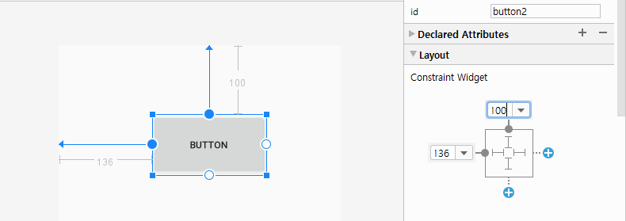
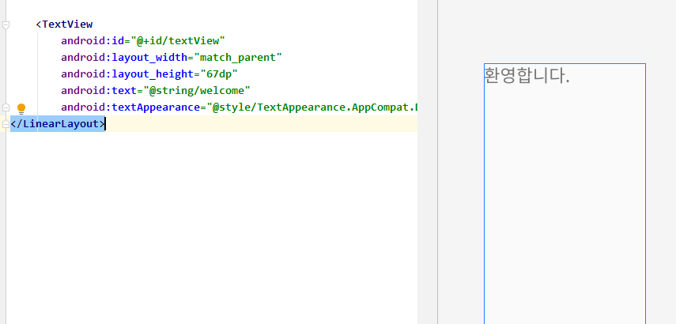
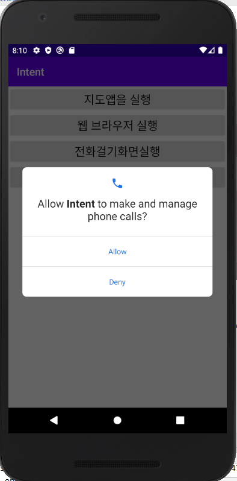
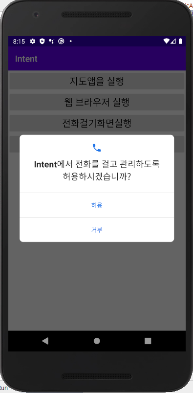
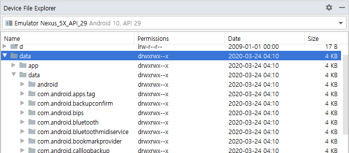
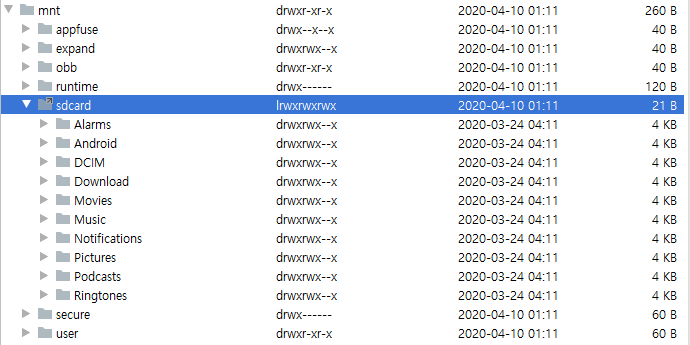
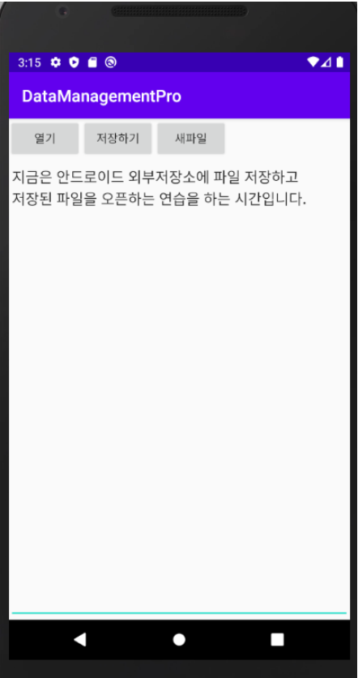

# 안드로이드

## 20-03-24 화

- acitivity_main.xml
- MainActivity.java
- AndoriodManifest.xml : 설명서(권한 등)

- java(genrated) 폴더는 자동생성폴더라 건드리면 X
- res폴더
- 슬래시 기준으로 뒤에 있는게 피일명, 뒤에있는게 폴더명
- @는 참조하고 있다는 뜻
- 폴더에다가 넣는다고 자동인식하는 거이 아니다.
- res폴더에 추가하면 => 리소스를 관리하는 R파일에 내용이 자동으로 저장
- common attribute는 모든 위젯에 공통으로 가지고있는 속성


<< 실습 1 >>

새로운프로젝트 작성( File - New - NewProject )

- App명 : firstPro
- package : exam.day01.first
- 프로젝트명 : firstPro
- 과제 : 화면에 표시된 레이블을 지우고 버튼 세 개를 추가 
  - 확인, 취소, 삭제
  - 글꼴 변경
  - avd에 실행해보기


### - MainActivity 실행흐름

1. onCreate ( **최초 한번 실행** ) 
2. onStart - ( **셋팅이나 자원, 커넥션 등의 작업을 수행** )
3. onResume
4. onPause  = > 일시정지 구간
5. onStop = > 일시정지 구간
   1. 다시 2번(onStart)으로.
6. onDestroy

---

## 20-03-25 수


- LinearLayout

- app :

- tools : device에는 적용 X

  => 안드로이드 스튜디오에서만 보여지는 속성

- 썬...?오라클..? 소송...?

### 1. Linear Layout 

> 순차적으로 배치(평행, 수직)

- layout_width : view의 너비

  - match_parent :부모의 width size만큼 꽉차게 그리겠다. 폰 size에 꽉차게 레이아웃에 그리겠다.

  - wrap_content : 자기가 갖고 있는 view의 size만큼 꽉차게 그리겠다.

- layout_height : view의높이

- layout_weight : 여백을 해당 view의 사이즈로 포함

  => view가 여러개면 그 view들이 사이즈를 나눠갖겠다!

- layout_gravity : parent내부에서 view의 정렬

- gravity : view내부에서의 정렬

- orientation : 배치 방향

- id : 각 위젯을 식별할 수 있는 이름

  - btn, txt

- margin : 주위 여백

- padding : 내부 컨텐츠와 border사이의 간격

- **layout은 중첩해서 사용이 가능하다.**

  

  << 실습 >>

  linear_exam01.xml

  linear_exam02.xml

  linear_exam03.xml


### 2. Constraint Layout

> view를 배치하는 것에 제약사항이 있는것




### activity


- 저 두가지 태그가 둘 다 있으면 맨 처음 실행된다.

- 추가로 액티비티를 사용하기 위해서는 Manifest에 등록해줘야 한다.


---

## 20-03-26 목

### 3. Relative Layout

> 상대 레이아웃

- 상대 레이아웃으로 만들 수 있는 화면 레이아웃은 대부분 제약레이아웃으로 만들수 있음.
- 따라서 권장하지않아요~
- 다만 예전에 만든 레이아웃이 '상대'인것이 많기 때문에 알야둬야 한다.


- View : 맨 마지막에 만들어진게 가장 위에 올라온다.
- 모든것들은 제약레이아웃에도 동일하게 적용된다.
- 성능면으로도 제약레이아웃이 더 좋아요.


### 4. Table Layout

> linear layout보다 weight를 주기가 편리하다~ 


- stretchColumns : 가로방향으로 여유 공간이 있다면 그 여유공간까지 모두 채워서 칼럼을 설정
- 결국은 리니어를 가장 많이 써요~

### 5. Frame Layout

> 여러개의 뷰를 보여주기 위해서 사용

#### 5-1 ImageView_Test

- 안드로이드를하려면 코틀린도 해야한다.
- 화면을 xml로 만든다? => 화면에 변화가 없다.
- 화면에 변화를 주려면 소스코드로 만들어야 해요~

#### 5-2 ScrollView_Test

- ScrollView의 하위는 한 개만 정의해야 한다.

- ScrollView를 추가할 때는 항상 추개햐아함.

  ```bash
  <ScrollView 
  	android:fillViewport="true">
  ```

### 이벤트처리하기

- 이벤트소스 : 이벤트를 발생시키는 객체( ex.버튼 )
- 이벤트리스너 : 이벤트 발생 시 리스너가 가지고 있는 메소드를 실행


### 익명이너클래스


---

## 20-03-27 금

- drawble_test
- drawble_img_커스터마이징하기


### TextTestActivity

- AppCompat : OS에 맞게 화면으루 맞춰주겟다.


#### - 리소스의 외부화

- 





#### 이너클래스

#### 외부클래스

## 20-04-06 월

> etc뷰 , 선택위젯, 인텐트(액티비티 -> 액티비티의 전환)(레이아웃 인플레이션)

- 액티비티는 화면.

  - 액티비티A -> 액티비티B를 실행하고싶다?
  - new에서 생성하지 않는다. => 컴포넌트 시스템(안드로이드 내부에서 요청 후 실행)
  - **모든것은 manifest파일을 기반으로 한다!!**

- 현재 안드로이드 버전에서는 캐스팅코드가 필요없다.

- 안드로이드의 매개변수에는 값을 입력 후 자동으로 이름이 출력된다. => 변경하면 안됨

- *이벤트를 붙이는 방법*

  - new View.OnClickListener()를 이용해 직접 onclick메소드를 생성
  - 이벤트를 implements하여 this로 작업
  - 익명이너 클래스로 리스너를 따로 만들어서 이용

- 무조건 리스너를 연결하는 작업을 해줘야함

  => 이벤트연결(위젯이 이벤트에 반응할 수 있도록 연결)

- AppCompat : 어떤 기종이든, 버전이든 최대한 뷰를 맞춰주기 위한코드

- 모든 리소스는 수치화하여 int로 저장된다.

- 안드로의 리소스명은 모두 소문자로 사용해야한다.

### etc_view

> datepicker, calendarview 를 이용해서 스케쥴,일정알림 커스터마이징 가능

### 체크박스

- if/else를 사용하면 불필요하게 코드가 길어진다.
- 자바기반이기때문에 배열 등 자료구조를 이용해서 디자인할 수 있다.

### 라디오박스

### 선택위젯

- 선택위젯과 일반위젯의 차이는 선택위젯은 어댑터 패턴을 사용한다.

### Adapterview ?!

> AdapterView이전의 View들은 따로 디자인하지 않아도 화면에 표시된다.
>
> AdapterView이후의 View들은 따로 코드와 결합해주어야 화면에 표시된다.

#### Adapter 객체

> 리스트 View와 + 리스트뷰에 뿌려질 Data + 어떤식으로 뿌릴지에 대한(Row에 대한) Design
>
> => 이것들을 하나로 mix하는 것이 Adapter 객체이다.
>
> => 마음에 안들것이니 Customizing 해야한다~~

- ListViewTest
- SimpleAdapterTest
- CustomRowTest

---

## 20-04-07 화

### 레이아웃 인플레이션

> XML레이아웃의 내용이 메모리에 객체화되는 과정

- 패키지 구분하기.

- 레이아웃을 만들때는 항상 context 객체가 들어간다.

- .this 객체를 지정할 때, 익명이너클래스는 객체가 될 수 없기 때문에 아우터클래스.this를 활용하여 아우터클래스를 지칭해줘야 한다.

- 이너클래스에서 아우터클래스의 변수를 접근할 때는 final을 붙여줘야한다.

- **layout Inflator**

  ```java
   protected void onCreate(Bundle savedInstanceState) {
          super.onCreate(savedInstanceState);
          setContentView(R.layout.activity_inflator_test);
          Button btn = findViewById(R.id.btnAdd);
          final LinearLayout container = findViewById(R.id.container);
          //레이아웃
          btn.setOnClickListener(new View.OnClickListener() {
              @Override
              public void onClick(View v) {
                  LayoutInflater inflater = 	(LayoutInflater)getSystemService(Context.LAYOUT_INFLATER_SERVICE);
                  inflater.inflate(R.layout.include_view, container, true);
              }
          });
      }
  ```

- 작업을 adapter로 하기 때문에 adapter가 없다면 xml파일의 id를 찾아오지 못하고 => 사용하지 못한다.

### 사용자정의 Adapter 만들기

> 사용자 정의로 디자인한 뷰를 목록으로 사용하고 싶은 경우

- 안드로이드에서 앱을 구성할 때 목록형식을 가장 많이 사용

- 안드로이드 내부에서 제공하는 Adapter로 표현하고 싶은 내용을 모두 표현할 수 없다.

  => 이벤트연결, 각 목록의 구성을 다르게 생성

#### [구성요소]

- Adapter를 이용해서 출력할 데이터를 저장하는 객체 ( ex. DTO ) 

  - 안드로이드는 getter,setter를 써도되고 안써도 된다. 변수로 접근하는 것이 가능하다.(웹과의 차이점)

- *사용자 정의 Adapter*

  ##### 1) 안드로이드에서 제공하는 Adapter클래스를 상속

  - 리스트뷰를 만들 때 필요한 정보를 저장할 수 있도록 멤버변수 정의

    ```java
    정의(Context, row디자인 리소스, 데이터)
    ```

  ##### 2) 생성자 정의

  - 상속받고 있는 ArrayAdapter의 생성자 호출

  ##### 3) ArrayAdapter에 정의되어 있는 메소드를 오버라이딩

  - getView : 리스트뷰의 한 항목이 만들어질 때마다 호출

    => 전달된 리소스를 이용해서 뷰를 생성(LayoutInflator)

    => 한 row를 구성하는 뷰를 찾아서 데이터와 연결

  ##### 4) getView메소드에서 성능개선을 위한 코드를 작성

  - 한번 생성한 view를 재사용
  - findViewById는 한 번만 찾아오기

  ##### 5) ViewHolder라는 객체를 생성

  - row를 구성ㄹ하는 뷰를 한 번 findViewById하기
  - row에 대한 구성 View를 멤버변수로 선언
  - 생성자에서 findViewById처리를 구성
  - 최초로 뷰를 만들 때(row에 대한 뷰) 이 객체를 활용

  ##### 6) row를 구성하는 뷰에 상태값을 저장하기

  - 각 뷰의 이벤트를 통해 저장

  - 각 뷰의 상태값을 저장할 수 있도록 객체를 생성

    => 상태값을 저장한 객체를 자료 구조에 저장 

    ​	=> focus를 잃어버릴 때 상태를 저장

  ```java
  < xml파일 >
  <LinearLayout xmlns:android="http://schemas.android.com/apk/res/android"
      xmlns:app="http://schemas.android.com/apk/res-auto"
      xmlns:tools="http://schemas.android.com/tools"
      android:orientation="vertical"
      android:layout_width="match_parent"
      android:layout_height="match_parent"
      tools:context=".view.activity.CustomAdapterTestActivity">
      <TextView
          android:id="@+id/txtInfo_cust"
          android:layout_width="match_parent"
          android:layout_height="wrap_content"
          android:textAppearance="@style/TextAppearance.AppCompat.Large"
          android:text="Info"/>
      <ListView
          android:id="@+id/cust_listview"
          android:layout_width="match_parent"
          android:layout_height="wrap_content"/>
  
  </LinearLayout>
  ```

  ```java
  public class MyAdapter extends ArrayAdapter<User>{
      private Context context;
      private int resId;
      private ArrayList<User> datalist;
  
      public MyAdapter(Context context, int resId, ArrayList<User> datalist) {
          super(context, resId, datalist);
          this.context = context;
          this.resId = resId;
          this.datalist = datalist;
      }
  
      //리스트 갯수를 반환
      @Override
      public int getCount() {
          return datalist.size();
      }
      //매개변수로 전달받은 순서에 있는 리스트 항목을 반환
      @Override
      public User getItem(int position) {
          return datalist.get(position);
      }
      //리스트의 한 항목을 만들 때 호출되는 메소드 - 리스트항목이 100개면 100번 호출
      //position => 리스트 순서
      //convertView => 한 항목에 대한 뷰를 리턴
      @Override
      public View getView(int position, View convertView, ViewGroup parent) {
          Log.d("getview","getview"+position);
          long start = System.nanoTime();
          //View를 생성
          LayoutInflater inflater =
                  (LayoutInflater)context.getSystemService(Context.LAYOUT_INFLATER_SERVICE);
          convertView = inflater.inflate(resId, null);
  
          //ArrayList에서 리턴된 리스트 항목의 번호와 동일한 데이터를 구하기
          User user = datalist.get(position);
  
          //위에서 생성한 뷰의 각 요소에 데이터를 연결
          ImageView imageView = convertView.findViewById(R.id.img);
          TextView nameView = convertView.findViewById(R.id.txtcust1);
          TextView telNumView = convertView.findViewById(R.id.txtcust2);
  
          imageView.setImageResource(user.myImg);
          nameView.setText(user.name);
          telNumView.setText(user.telNum);
  
          long end = System.nanoTime();
          Log.d("getview",(end-start)+"");
  
          return convertView;
      }
  }
  ```

  => getSystemService는 context가 갖고 있는 환경정보이다.

  => 커스터마이징 하는 getView는 액티비티가 아니기 때문에 위에 선언한 context를 이용하여 getSystemService 호출

  ```java
  public class CustomAdapterTestActivity extends AppCompatActivity {
  
      @Override
      protected void onCreate(Bundle savedInstanceState) {
          super.onCreate(savedInstanceState);
          setContentView(R.layout.activity_custom_adapter_test);
          TextView info = findViewById(R.id.txtInfo_cust);
          ListView listView = findViewById(R.id.cust_listview);
  
          //1. list에 출력할 데이터
          ArrayList<User> datalist = new ArrayList<User>();
          for(int i=1; i<101; i++){
              User user = new User(R.drawable.ic_launcher_foreground,
                                  "name"+i,
                                  "000000"+i);
              datalist.add(user);
          }
          //2. 사용자정의 어댑터 객체 생성
          MyAdapter adpater = new MyAdapter(this, R.layout.custrow2, datalist);
  
          //3. ListView에 어댑터 연결
          listView.setAdapter(adpater);
      }
  }
  ```

- Adapter를 통해 만들어진 리스트뷰를 보여줄 액티비티
  
  - main layout필요 !

#### MyAdapt의 성능개선.ver

> 성능 개선을 위한 작업 추가
>
> 1. 한번 만든 뷰는 재사용
> 2. findViewById 한 번 작업한 뷰에 대한 정보는 저장해 놓고 다시 사용

```java
public class MyAdapter2 extends ArrayAdapter<User>{
    private Context context;
    private int resId;
    private ArrayList<User> datalist;

    //row마다 사용자가 설정한 값을 position과 함께 저장
    //해당 position에 대한 설정 값을 같이 출력
    //저장하는 시점은 사용자가 설정을 끝낸 시점 - focus를 잃어 버리는 시점
    HashMap<Integer, SaveUserState> saveData = new HashMap<Integer, SaveUserState>();

    public MyAdapter2(Context context, int resId, ArrayList<User> datalist) {
        super(context, resId, datalist);
        this.context = context;
        this.resId = resId;
        this.datalist = datalist;
    }

    //리스트 갯수를 반환
    @Override
    public int getCount() {
        return datalist.size();
    }

    //매개변수로 전달받은 순서에 있는 리스트 항목을 반환
    @Override
    public User getItem(int position) {
        return datalist.get(position);
    }

    //리스트의 한 항목을 만들 때 호출되는 메소드 - 리스트항목이 100개면 100번 호출
    //position => 리스트 순서
    //convertView => 한 항목에 대한 뷰를 리턴
    @Override
    public View getView(final int position, View convertView, ViewGroup parent) {
        Log.d("getview","getview"+position);
        long start = System.nanoTime();
        //View를 생성 - 매개변수로 전달되는 converView를 재사용
        UserViewHolder holder = null;
        if(convertView==null){
            LayoutInflater inflater =
                    (LayoutInflater)context.getSystemService(Context.LAYOUT_INFLATER_SERVICE);
            convertView = inflater.inflate(resId, null);

            //============최초작업이므로 뷰를 찾아서 가져오기=============
            holder = new UserViewHolder(convertView);
            //홀더를 저장
            convertView.setTag(holder);
        }else{
            //=============최초 작업이 아니라 뷰를 재사용하는 중이라면============
            holder = (UserViewHolder)convertView.getTag();
        }

        //ArrayList에서 리턴된 리스트 항목의 번호와 동일한 데이터를 구하기
        User user = datalist.get(position);
        if(user!=null){
            //위에서 생성한 뷰의 각 요소에 데이터를 연결
            ImageView imageView = holder.myImg;
            TextView nameView = holder.nameView;
            TextView telNumView = holder.telNumView;
            final EditText editView = holder.editView;

            imageView.setImageResource(user.myImg);
            nameView.setText(user.name);
            telNumView.setText(user.telNum);

            //뷰를 만들때 저장된 내용이 있는지 체크해서 값을 출력하기
            SaveUserState state = saveData.get(position);
            if(state==null){ // 저장된 객체가 없으면 빈 값을 출력
                editView.setText("");
            }else{ // 저장된 객체가 있음면 객체에서 data를 추출해서 출력
                editView.setText(state.data);
            }

            //EditText가 focus를 잃어버리는 시점에 입력한 데이터를 저장
            editView.setOnFocusChangeListener(new View.OnFocusChangeListener() {
                @Override
                public void onFocusChange(View v, boolean hasFocus) {
                    if(!hasFocus){
                        String data = editView.getText().toString();
                        SaveUserState objstate = new SaveUserState();
                        objstate.data = data;
                        saveData.put(position, objstate);
                    }
                }
            });
        }

        long end = System.nanoTime();
        Log.d("getview",(end-start)+"");
        return convertView;
    }
}

```

#### ExamAdapt

```java
public class ExamAdapter extends ArrayAdapter {
    private Context context;
    private int resId;
    private ArrayList<ActorItem> actorlist;

    HashMap<Integer, SaveActorState> saveData = new HashMap<Integer, SaveActorState>();

    public ExamAdapter(Context context, int resId, ArrayList<ActorItem> actorlist) {
        super(context, resId, actorlist);
        this.context = context;
        this.resId = resId;
        this.actorlist = actorlist;
    }

    @Override
    public Object getItem(int position) {
        return super.getItem(position);
    }

    @Override
    public View getView(final int position, View convertView, ViewGroup parent) {

        ViewHolder holder = null;
        if(convertView==null){
            LayoutInflater inflater =
                    (LayoutInflater)context.getSystemService(Context.LAYOUT_INFLATER_SERVICE);
            convertView = inflater.inflate(resId, null);

            //============최초작업이므로 뷰를 찾아서 가져오기=============
            holder = new ViewHolder(convertView);
            //홀더를 저장
            convertView.setTag(holder);
        }else{
            //=============최초 작업이 아니라 뷰를 재사용하는 중이라면============
            holder = (ViewHolder)convertView.getTag();
        }

        ActorItem actor = actorlist.get(position);
        if(actor!=null){
            //위에서 생성한 뷰의 각 요소에 데이터를 연결
            ImageView imageView = holder.myImg;
            TextView nameView = holder.nameView;
            TextView dateView = holder.dateView;
            TextView textView = holder.textView;
            final CheckBox checkView = holder.checkView;

            imageView.setImageResource(actor.myImg);
            nameView.setText(actor.name);
            dateView.setText(actor.date);
            textView.setText(actor.text);

            //뷰를 만들때 저장된 내용이 있는지 체크해서 값을 출력하기
            SaveActorState state = saveData.get(position);
            if(state==null){ // 저장된 객체가 없으면 빈 값을 출력
                checkView.setChecked(false);
            }else{ // 저장된 객체가 있음면 객체에서 data를 추출해서 출력
                checkView.setChecked(state.chkValue);
            }

            checkView.setOnClickListener(new View.OnClickListener() {
                @Override
                public void onClick(View v) {
                    boolean chkValue = checkView.isChecked();
                    SaveActorState chkstate = new SaveActorState();
                    chkstate.chkValue = chkValue;
                    saveData.put(position, chkstate);
                }
            });


        }
        return convertView;
    }
}
```


### 안드로이드 앱의 네 가지 구성요소 (component)?

1. 액티비티(Activity)

   => 화면

2. 서비스(Service)

3. 브로드캐스트 수신자(Broadcast Receiver)

   => 영상통화-배터리량보존되어야함- 이럴때.

   => device에서 일어나는 어떤 사건이 언제일어날지 모를 때 사용

4. 내용 제공자(Content Provider)

   => 화면 공유 , 데이터 공유 가능하게 함

### Intent(인텐트)

> 여러 화면간 전환을 위해 사용 ( 두 가지 방법 존재)

- 실행흐름

  : Activity "A" -> Intent -> 안드로이드OS -> Intent -> Activity "B"

---

## 20-04-08 수

### ** Intent(인텐트)

> 안드로이드에서 사용하는 주요 컴포턴트 4개는 안드로이드 OS에서 실행되게 해주어야 한다. 이를 이해 Activity간의 화면전환을 위해 데이터 Intent가 전달하며 공유하는 방식.

#### [기본 실행흐름]

1. 인텐트 객체를 생성하고 실행할 액티비티의 정보와 데이터를 셋팅
   - 값 셋팅 : putExtra 메소드를 이용
   - 객체 셋팅 : Parcelable을 implement하여 이용
     - writeToParcel 메소드 자동호출
2. 안드로이드OS에 인텐트 객체 넘기며 의뢰
   - startActivity : 액티비티 실행
3. 인텐트에 설정되어 있는 액티비티 호출
4. 호출된 액티비티에서는 안드로이드OS가 넘겨준 인텐트를 가져오기
5. 인텐트에 셋팅된 데이터를 꺼내서 활용

```java
public class ReturnDataFirstActivity extends AppCompatActivity
			implements OnClickListener{

    public static final int SECOND_BUTTON = 10;
    /** Called when the activity is first created. */
	Button bt1;
	Button bt2;
    Button bt3;
    @Override
    public void onCreate(Bundle savedInstanceState) {
        super.onCreate(savedInstanceState);
        setContentView(R.layout.first2);
        bt1 = (Button)findViewById(R.id.call1);
        bt2 = (Button)findViewById(R.id.call2);
        bt3 = (Button)findViewById(R.id.btnExit);
        
        bt1.setOnClickListener(this);
        bt2.setOnClickListener(this);
        bt3.setOnClickListener(this);
        Log.d("kim","onCreate()");
    }
	@Override
	public void onClick(View v) {
		if(v.getId()==R.id.btnExit){
		    finish();
        }else if(v.getId()==R.id.call1){
		    Intent intent  = new Intent();
            intent.putExtra("info","첫 번째 액티비티가 넘기는 메시지");
            startActivity(intent);
        }else if(v.getId()==R.id.call2){
		    //새로운 액티비티를 실행해서 작업을 완료한 후 되돌아오는 작업을 수행
            Intent intent = new Intent(this, ReturnDataSecondActivity.class);
            intent.putExtra("code","call2");
            intent.putExtra("data","첫 번째 액티비티가 넘기는 메시지");

            //되돌아올 때 사용되는 메소드가 startActivityForResult
            //인텐트객체와 함께 request_code를 넘긴다.(사용자 정의)
            startActivityForResult(intent, SECOND_BUTTON);
        }
	}

	//인텐트를 통해서 액티비티를 호출하고 되돌아오는 경우 자동으로 onActivityResult를 호출한다
    //  => 되돌아와서 마무리해야 하므로!
    //  => onActivityResult를 오버라이딩해서 처리할 작업을 구현해주자
    // * reuqestCode : 요청을 했던 뷰를 구분하기 위한 코드
    // * resultCode : 결과 코드
    // * data : Intent객체
    @Override
    protected void onActivityResult(int requestCode, int resultCode, Intent intent) {
        super.onActivityResult(requestCode, resultCode, intent);
        if(requestCode==SECOND_BUTTON && resultCode==RESULT_OK){
            String returndata = intent.getStringExtra("second");
            Toast.makeText(this, returndata, Toast.LENGTH_LONG).show();
        }
    }
}
```

```java
public class ReturnDataSecondActivity extends AppCompatActivity {
	String code;
	/** Called when the activity is first created. */
	@Override
	public void onCreate(Bundle savedInstanceState) {
	    super.onCreate(savedInstanceState);
	    setContentView(R.layout.second2);
	    Button bt1 = (Button)findViewById(R.id.btnClose1);
		final TextView txt = findViewById(R.id.secondTxt);
		final Intent intent = getIntent();
		code = intent.getStringExtra("code");
	    bt1.setOnClickListener(new OnClickListener() {
			@Override
			public void onClick(View v) {
				switch(code){
					case "call2":
						String data = intent.getStringExtra("data");
						txt.setText(data);

						intent.putExtra("second","두 번째 액티비티에서 실행 완료");

						//실행 후에 호출한 액티비티로 되돌아가기
						//되돌아갈 때 값을 공유하기 위해 intent객체를 넘긴다.
						setResult(RESULT_OK, intent);
						finish();
				}
			}
		});
	}

}
```

#### < intent-filter >

```java
<activity android:name=".exam.SelectView_ExamActivity">
    <intent-filter>
  	    <action android:name="com.exam.selectview"/> // 우리끼리만의 앱을 이용하고 싶을때 임의로 naming
        <category android:name="android.intent.category.DEFAULT"/> //안드로이드가 실행할 범주
    </intent-filter>
 </activity>
```

#### BasicRunApp

- 지도앱 실행

  ```java
  protected void onCreate(Bundle savedInstanceState) {
      super.onCreate(savedInstanceState);
      setContentView(R.layout.activity_basic_app_run);
  }
  ```

- 웹 브라우저 실행

  ```java
  public void runGoogleMap(View v){
      Uri uri = Uri.parse("geo:37.501579 , 127.039585");
      Intent intent = new Intent(Intent.ACTION_VIEW, uri);
      startActivity(intent);
  }
  ```

- 전화걸기 화면 실행

  ```java
  public void runWeb(View v){
      Uri uri = Uri.parse("https://www.daum.net");
      Intent intent = new Intent(Intent.ACTION_VIEW, uri);
      startActivity(intent);
  }
  ```

- 전화걸기 실행

  ```java
  //AndroidManifest.xml
  <uses-permission android:name="android.permission.CALL_PHONE"/>
  
  //activity
  String[] permission_list = {
      Manifest.permission.CALL_PHONE
  };    
  
  @Override
  protected void onCreate(Bundle savedInstanceState) {
      super.onCreate(savedInstanceState);
      setContentView(R.layout.activity_basic_app_run);
  
      //권한체크 메소드를 호출
      runPermission();
  }
  
  //권한을 체크 - 승인처리
  public void runPermission(){
      //하위버전이면 실행되지 않도록 처리
      if(Build.VERSION.SDK_INT<Build.VERSION_CODES.M){
          return; //종료
      }
      //모든 권한을 셀프체크
      for(String permission:permission_list){
          int chk = checkCallingOrSelfPermission(permission);
          if(chk== PackageManager.PERMISSION_DENIED){
              requestPermissions(permission_list, 0);
              break;
          }
      }
  }
  
  //실제 전화 걸기 위한메소드
  public void runCallPhone(View v){
      Intent intent = null;
      int chk = PermissionChecker.checkSelfPermission(this, Manifest.permission.CALL_PHONE);
      if(chk==PackageManager.PERMISSION_GRANTED){
          Log.d("tel","성공");
          intent = new Intent(Intent.ACTION_CALL,
                              Uri.parse("tel:01072971287"));
      }else{
          Log.d("tel","실패");
          return;
      }
      startActivity(intent);
  }
  ```

  




---

## 20-04-10 금

### Permission

마시맬로 버전 이후부터는 퍼미션 등록뿐 아니라, 사용자가 사용하기 전 퍼미션 안내 및 등록 및 직접 설정

#### 종류

- 일반권함

- 위험권한

  > 액티비티를 실행하거나 버튼을 누르거나 어떤 기능을 사용할 때 권한에 대한 처리를 할 수 있도록 구현

  

  - **사용 메소드**

    - checkSelfPermission : 퍼미션의 현재 상태를 확인하는 메소드

      ```java
      - PERMISSION_DENIED : 퍼미션이 부여되지 않은 상태
      - PERMISSION_GRANTED : 퍼미션이 부여되지 있는 상태
      ```

    - requestPermissions : (checkSelfPermission : PERMISSION_DENIED )권한이 체크되어 있지 않은 경우에 권한을 요청하는 메시지를표시

      (이 메소드 이외에도 제공되는 메소드는 여러개임)

    - onRequestPermissionsResult : requestPermission의 결과로 호출되는 메소드

      ```java
      // 퍼미션 설정 정보를 매개변수로 넘긴다.
      int requestCode : 퍼미션 요청할 때 넘긴 요청코드
      String[] permissions : 요청퍼미션 목록
      int[] grantResults :퍼미션 설정 성공 결과
      ```

      

  - **처리 순서**

    1. 현재 사용하려고 하는 권한이 설정되어 있는지 체크

       => checkSelfPermission 을 이용

    2. 1번에서 리턴값이 PERMISSION_DENIED 인 경우 사용자가 권한을 설정할 수 있도록 메시지를 표시

       => requestPermissions

    3. 요청 처리 후 자동으로 호출되는 메소드를 통해 다음에 어떤 처리를 할 것인지 정의

       - 권한 성공 : 기능이 실행되도록
       - 권한 실패 : Preference를 통해 설정할 수 있도록 Activity를 이동하거나 안내 메시지 출력


#### 사용자 정의 Permmsion

```java
<uses-permission android:name="com.exam.permission.JAVA_PERMISSION" /> // 뷰에 대한 권한 설정 ((사용자))
<uses-permission android:name="android.permission.INTERNET"/> // 인터넷 권한 설정(( 일반 ))
<uses-permission android:name="android.permission.CAMERA"/> // 카메라 권한 설정 (( 위험 ))

<application android:usesCleartextTraffic="true" /> // 문자열 통신 text에 대한 설정
```

- 권한을 테스트할 때는 번거롭더라도 앱을 삭제하고 다시 실행하기

```java
public class RuntimePermissionTest extends AppCompatActivity {
    //퍼미션의 상태를 저장할 변수
    boolean permission_state; //초기값 false
    @Override
    protected void onCreate(Bundle savedInstanceState) {
        super.onCreate(savedInstanceState);
        setContentView(R.layout.activity_runtime_permission_test);
        // 1. Permission 먼저 체크
        if(ContextCompat.checkSelfPermission(this,
                Manifest.permission.CAMERA)== PackageManager.PERMISSION_GRANTED){
            permission_state = true;
            printToast("권한이 설정되었습니다.");
        }else{
            permission_state = false;
            printToast("권한을 설정해야 합니다.");
            // 2. 권한이 없는 경우 권한을 설정하는 메시지를 띄운다.
            ActivityCompat.requestPermissions(this, new String[]{Manifest.permission.CAMERA},
                    1000);
        }
    }

    // 3. requestPermissions의 메시지창에서 선택한 후 호출되는 메소드
    //  결과를 리턴 - 결과에 따라 다르게 처리할 수 있도록 구현
    @Override
    public void onRequestPermissionsResult(int requestCode, @NonNull String[] permissions,
                                           @NonNull int[] grantResults) {
        super.onRequestPermissionsResult(requestCode, permissions, grantResults);
        if(requestCode==1000 && grantResults.length>0){ //권한의 성공설정에 대한 결과가 있다는 의미
            if(grantResults[0] == PackageManager.PERMISSION_GRANTED){
                permission_state = true;
                printToast("권한 설정 마무리 완료~");
            }else{
                printToast("권한 설정을 하지 않았으므로 기능으 사용할 수 없습니다.");
            }
        }
    }

    public void printToast(String msg){
        Toast.makeText(this,msg,Toast.LENGTH_LONG).show();
    }

    public void runCamera(View v){
        if(permission_state){
            Intent intent = new Intent(MediaStore.ACTION_IMAGE_CAPTURE);
            startActivity(intent);
        }else{
            printToast("권한을 설정해야 기능을 사용할 수 있습니다.");
            //권한을 설정할 수 있는 Activity로 자동 이동되도록
            //(사용자로 하여금 권한을 다시 설정할 수 있도록 만들기)
        }

    }
}
```


### FileSystem



-  앱별로 내부저장소가 패키지별로 따로 관리가 되고 있고, 아무도 접근하지 못하는 공간.
- 패키지가 지워지면 자동으로 지워진다~


- 외부저장소인데 패키지 이름과 똑같이만들면 삭제될 때 같이 저장된다.



- 똑같이 외부저장소


- 똑같이 외부저장소


#### 내부저장소

- 이 앱만 사용하기 때문에 권한체크 안해도 됨

#### 외부저장소

- 외부저장소는 다른 것들을 같이 건드리지 못하도록 권한체크 필수
- 사용자로 하여금 권한을 줄건지 말건지 설정해야 함
- 데이터를 지워도 외부저장소에는 데이터가 남아있다.

```java
<uses-permission android:name="android.permission.WRITE_EXTERNAL_STORAGE"/> // 외부저장소 권한 설정
    
<application android:requestLegacyExternalStorage="true"> // 이전버전 저장소 권한 설정
```

```java
// 외부저장소/임의의디렉토리 생성
//  => 앱을 삭제해도 데이터는 남아있다.
String dirPath = external.getAbsolutePath()+"/myApp";

// 외부저장소/android/data/앱의 패키지 명으로 디렉토리 생성
//  => 앱 삭제하면 데이터가 같이 삭제된다.
String dirPath = external.getAbsolutePath();
```


**exam1** 

- 권한 체크는 액티비티
- 저장버튼을 눌렀을때
  - 권한 이 설정 된 경우 : Toast("권한설정 완료");
  - 권한 이 설정안된 경우 : Toast("권한설정하세요");

**exam2**

아래와 같이 단순한 형식의 메모장을 작성하세요.

레이아웃 - 버튼 세 개와 EditText(종류는 디자인 창에서 적절한 것을 찾아서 하세요)

- 기능 1 : Write와 Read기능을 구현하세요.

  - 모두 외부저장소에서 액세스 하도록 구현하세요

  - BufferedReader와 FileWriter를 이용하세요

  - EditText에 입력한 파일을 외부 저장소 디렉토리에 /mynote라는 폴더를 

    ​      만들고 오늘날짜_memo.txt로 저장하세요

    ​      ex) 4월10일 -> 20200410_memo.txt

- 기능 2 : 퍼미션에 대한 처리를 하세요

  - READ / WRITE에 대한 퍼미션을 모두 한 꺼번에 처리되도록 구현하세요.




