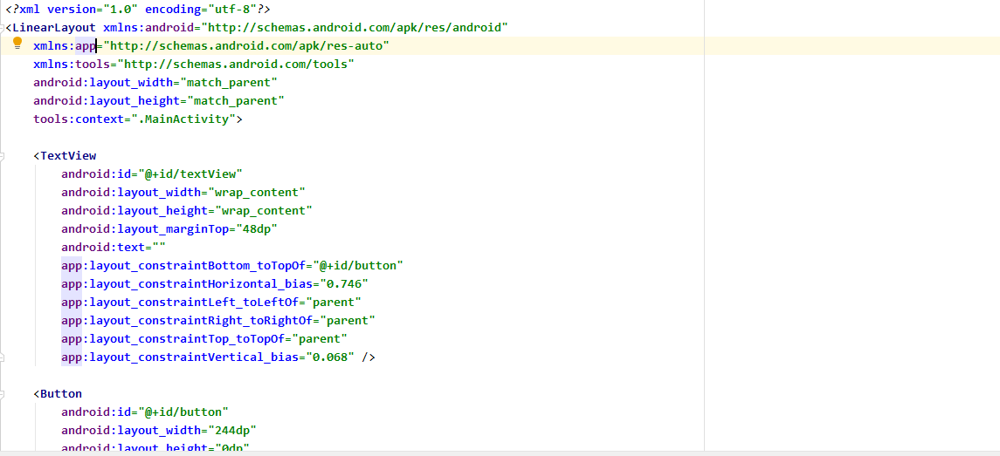
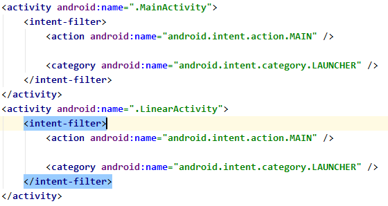
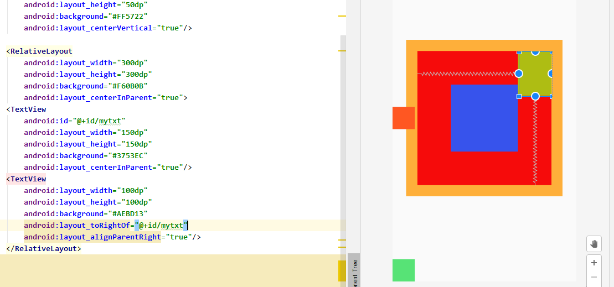

# 안드로이드

## 20-03-24 화

- acitivity_main.xml
- MainActivity.java
- AndoriodManifest.xml : 설명서(권한 등)

- java(genrated) 폴더는 자동생성폴더라 건드리면 X
- res폴더
- 슬래시 기준으로 뒤에 있는게 피일명, 뒤에있는게 폴더명
- @는 참조하고 있다는 뜻
- 폴더에다가 넣는다고 자동인식하는 거이 아니다.
- res폴더에 추가하면 => 리소스를 관리하는 R파일에 내용이 자동으로 저장
- common attribute는 모든 위젯에 공통으로 가지고있는 속성


<< 실습 1 >>

새로운프로젝트 작성( File - New - NewProject )

- App명 : firstPro
- package : exam.day01.first
- 프로젝트명 : firstPro
- 과제 : 화면에 표시된 레이블을 지우고 버튼 세 개를 추가 
  - 확인, 취소, 삭제
  - 글꼴 변경
  - avd에 실행해보기


### - MainActivity 실행흐름

1. onCreate ( **최초 한번 실행** ) 
2. onStart - ( **셋팅이나 자원, 커넥션 등의 작업을 수행** )
3. onResume
4. onPause  = > 일시정지 구간
5. onStop = > 일시정지 구간
   1. 다시 2번(onStart)으로.
6. onDestroy

---

## 20-03-25 수



- LinearLayout

- app :

- tools : device에는 적용 X

  => 안드로이드 스튜디오에서만 보여지는 속성

- 썬...?오라클..? 소송...?

### 1. Linear Layout 

> 순차적으로 배치(평행, 수직)

- layout_width : view의 너비

  - match_parent :부모의 width size만큼 꽉차게 그리겠다. 폰 size에 꽉차게 레이아웃에 그리겠다.

  - wrap_content : 자기가 갖고 있는 view의 size만큼 꽉차게 그리겠다.

- layout_height : view의높이

- layout_weight : 여백을 해당 view의 사이즈로 포함

  => view가 여러개면 그 view들이 사이즈를 나눠갖겠다!

- layout_gravity : parent내부에서 view의 정렬

- gravity : view내부에서의 정렬

- orientation : 배치 방향

- id : 각 위젯을 식별할 수 있는 이름

  - btn, txt

- margin : 주위 여백

- padding : 내부 컨텐츠와 border사이의 간격

- **layout은 중첩해서 사용이 가능하다.**

  

  << 실습 >>

  linear_exam01.xml

  linear_exam02.xml

  linear_exam03.xml


### 2. Constraint Layout

> view를 배치하는 것에 제약사항이 있는것


### activity


- 저 두가지 태그가 둘 다 있으면 맨 처음 실행된다.

- 추가로 액티비티를 사용하기 위해서는 Manifest에 등록해줘야 한다.



---

## 20-03-26 목

### 3. Relative Layout

> 상대 레이아웃

- 상대 레이아웃으로 만들 수 있는 화면 레이아웃은 대부분 제약레이아웃으로 만들수 있음.
- 따라서 권장하지않아요~
- 다만 예전에 만든 레이아웃이 '상대'인것이 많기 때문에 알야둬야 한다.




- View : 맨 마지막에 만들어진게 가장 위에 올라온다.
- 모든것들은 제약레이아웃에도 동일하게 적용된다.
- 성능면으로도 제약레이아웃이 더 좋아요.


### 4. Table Layout

> linear layout보다 weight를 주기가 편리하다~ 


- stretchColumns : 가로방향으로 여유 공간이 있다면 그 여유공간까지 모두 채워서 칼럼을 설정
- 결국은 리니어를 가장 많이 써요~

### 5. Frame Layout

> 여러개의 뷰를 보여주기 위해서 사용

#### 5-1 ImageView_Test

- 안드로이드를하려면 코틀린도 해야한다.
- 화면을 xml로 만든다? => 화면에 변화가 없다.
- 화면에 변화를 주려면 소스코드로 만들어야 해요~

#### 5-2 ScrollView_Test

- ScrollView의 하위는 한 개만 정의해야 한다.

- ScrollView를 추가할 때는 항상 추개햐아함.

  ```bash
  <ScrollView 
  	android:fillViewport="true">
  ```

### 이벤트처리하기

- 이벤트소스 : 이벤트를 발생시키는 객체( ex.버튼 )
- 이벤트리스너 : 이벤트 발생 시 리스너가 가지고 있는 메소드를 실행


### 익명이너클래스


---

## 20-03-27 금

- drawble_test
- drawble_img_커스터마이징하기


### TextTestActivity

- AppCompat : OS에 맞게 화면으루 맞춰주겟다.


#### - 리소스의 내부화

- 


#### 이너클래스

#### 외부클래스


