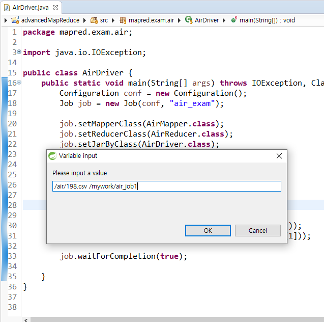
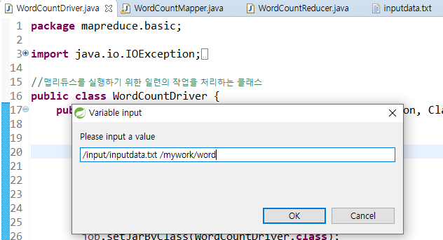
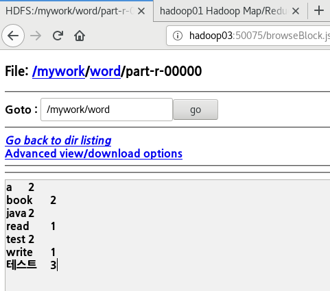
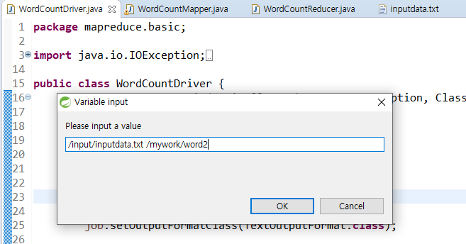
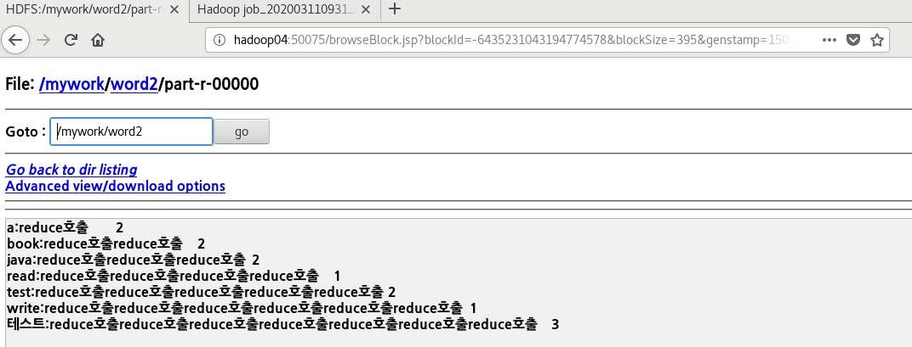

# 빅데이터

## 20-02-11 화

### << 빅데이터 플랫폼 구축 >>

### - 리눅스

* 리눅스 상용화=> 레드햇 계열? 발전=>CentOS(서버구축에 적합)
* 내부 자원에 대해 모든 접근 권한을 정의할 수 있다.
  * 보안 유지에 적합하다.
  * 네트워크를 저가로 구성하기 좋다.

### - 머신 생성( VMWare설치 ) 총 4대의 CentOS 설치

* root => 프롬프트 #
* 일반계정 =.프롬프트 $

#### home(디렉토리)

- 특정 계정으로 로그인 했을 때 자동으로 위치하는 폴더
- 모든 계정은 홈디렉토리를 갖고 있다.
- 기본 설정은 홈디렉토리 명이 계정명과 동일
- root의 홈디렉토리명은 root폴더
- " / " <<< 제일 처음!!! (시작 위치)
- su
  - 
- su -
  - 
- 처음들어가면 ~] 이 들어 있고, ~은 홈 디렉토리를 의미한다.
- 일반계정의 홈디렉토리 => /home/hadoop(계정명)
- ls 현재 위치의 폴더
- cd/ => 최상위로 빠져나감
- cd~ => 홈으로 빠져나감
- cd.. => 한단게 빠져나감 


* 컴퓨터 - etc => 리눅스 설정 파일들이 담겨 있는 폴더
* 컴퓨터 - usr => 윈도우로 치면 programfiles
* 컴퓨터 - dev => 장치에 대한 정보

## 02-02-12 수

## << 빅데이터 플랫폼 구축>>

### 1. VMware 설치

### 2. 머신생성  - CentOS7

### 3. 머신 복제

- Hadoop01 : 192.168.111.128
- Hadoop02 :  192.168.111.129
- Hadoop03 : 192.168.111.131
- Hadoop04 : 192.168.111.130

### 4. 머신 4대를 클러스터링

#### 1) 방화벽 해제

* 방확벽보기

  ```bash
  systemctl status firewalld
  ```

* 방화벽 중지

  ```bash
  systemctl stop firewalld
  ```

* 시스템 리부팅

  ```bash
  reboot
  ```

* 방화벽 정지

  ```bash
  systemctl disable firewalld - "이렇게 해야 정지가 된다."
  ```

#### 2) hostname 변경

* hostname 이름 바꾸기

  ``` bash
  " tab누르면 자동완성 가능 "
  hostnamectl set-hostname hadoop01
  ```

#### 3) DNS 설정

- 우리는 Host-only와 NAT네트워크망의 구성.
- Bridge형식을 취하면 host 레벨의 ip를 받아서 사용가능

* 특정 ip로 접속하기

* ``` bash
  ssh 192.168.111.128
  ```

* system 서비스 목록보기

  ```bash
  systemctl list-units --type=service
  ```

* host에 hadoop 저장

  ```bash
  '다른위치-컴퓨터-etc-hosts파일'
  192.168.111.128 hadoop01
  192.168.111.129 hadoop02
  192.168.111.131 hadoop03
  192.168.111.130 hadoop04
  ```

* hadoop01머신에서 hadoop02, hadoop03, hadoop04에 직접 접속

  ```bash
  /etc/init.d/network restart
  ssh hadoop02
  ssh hadoop03
  ssh hadoop04
  ```

* 원격 서버로 copy

  ```bash
  scp 	copy할파일(위치까지 명시) 	copy받을서버의 위치
  scp		/etc/hosts 		root@hadoop02:/etc/hosts
  '명령어	copy할파일		target서버의 위치와 파일명'
  ```

* 원격 서버에 실행명령

  ```bash
  ssh		서버		'실행할 명령문'
  ```

* 암호화된 통신을 위해서 공개키 생성 후 배포

  * pub : 공개키

  ```bash
  cd ~
  ssh-keygen -t rsa
  cd. ssh
  ls
  ssh-copy-id -i id_rsa.pub hadoop@hadoop02
  ```

  

## 20-02-13 목

> 리눅스는 소유권한이라는게 있다. 따라서 권한을 신경써주자.

* jdk(RPM) 다운 후 설치하기

  ```bash
  rpm -Uvh jdk-8u231-linux-x64.rpm
  'U' - 'update'
  'V' - 'view'
  'H' - '설치하겠다.'
  ```

* Hadoop 다운 후 설치하기

  ```bash
  1. tar-zxvf hadoop-1.2.1.tar.gz 
  'Z' - 'gzip사용'
  'X' - '기존의 tar파일의 압축을 풀어주겠다'
  'V' - '명령어 실행시 화면에 출력'
  'F' - '파일의 이름을 지정'
  
  2. scp /home/hadoop/hadoop-1.2.1.tar.gz hadoop@hadoop02:/home/hadoop/ - '복사하기'
  3. ssh hadoop03 "tar zxvf hadoop-1.2.1.tar.gz" - '압축풀기'
  
  ```

* 각종 설정하기

  ```bash
  <<< home - hadoop - hadopo.1.2.1. - conf >>>
  "<hadoop-env.sh>"
  # The java implementation to use.  Required.
  export JAVA_HOME=/usr/java/jdk1.8.0_231-amd64
  
  "<master>"
  hadoop02
  
  "<slaves>"
  hadoop02
  hadoop03
  hadoop04
  
  "<core-site.xml>"
  	<configuration>
  		<property>
  			<name>fs.default.name</name>
  			<value>hdfs://hadoop01:9000</value>
  		</property>
  		<property>
  			<name>hadoop.tmp.dir</name>
  			<value>/home/hadoop/hadoop-data</value>
  		</property>
  	</configuration>
  	
  "<hdfs-site.xml>"	
  	<configuration>
  	<property>
  		<name>dfs.replication</name>
  		<value>3</value>
  	</property>
  	<property>
  		<name>dfs.http.address</name>
  		<value>hadoop01:50070</value>
  	</property>
  	<property>
  		<name>dfs.secondary.http.address</name>
  		<value>hadoop02:50090</value>
  	</property>
  	</configuration>
  	
  "<mapred-site.xml"
  	<configuration>
  	<property>
  		<name>mapred.job.tracker</name>
  		<value>hadoop01:9001</value>
  	</property>
  	</configuration>
  	
  "02,03,04에 설정 복사"
  scp /home/hadoop/hadoop-1.2.1/conf/* hadoop@hadoop02:/home/hadoop/hadoop-1.2.1/conf
  scp /home/hadoop/hadoop-1.2.1/conf/* hadoop@hadoop03:/home/hadoop/hadoop-1.2.1/conf
  scp /home/hadoop/hadoop-1.2.1/conf/* hadoop@hadoop04:/home/hadoop/hadoop-1.2.1/conf
  	
  "format하기"	
  /home/hadoop/hadoop-1.2.1/bin/hadoop namenode -format
  
  "Hadoop 시작하기"
  /home/hadoop/hadoop-1.2.1/bin/start-all.sh
  
  "02,03,04에 밀어넣기"
  jps
  ssh hadoop02 "jps"
  ssh hadoop03 "jps"
  ssh hadoop04 "jps"
  ```


## 20-02-14 금

1. jps 로 hadoop 머신들 역할 확인

2. hadoop 실행

   ```bash
   /home/hadoop/hadoop-1.2.1/bin/start-all.sh
   ```

3. input 추가

   ```bsh
   /home/hadoop/hadoop-1.2.1/bin/hadoop fs -ls /input
   ```

4. input 삭제

   ```bsh
   /home/hadoop/hadoop-1.2.1/bin/hadoop fs -rmr /input
   ```

5. 폴더 생성

   ```bash
   /home/hadoop/hadoop-1.2.1/bin/hadoop fs -mkdir /input
   ```

6. 파일 복사하기

   ```bash
   /home/hadoop/hadoop-1.2.1/bin/hadoop fs -copyFromLocal README.txt /input
   ```

7. wordcount 적용하기

   ```bash
   ./bin/hadoop jar hadoop-examples-1.2.1.jar wordcount /input/README.txt /output
   ```

   


* 여기서 쓰고 파폭에서 http://hadoop04:50075로 확인가능


예제) hadoop-examples-1.2.1.jar의 wordcount를 이용해서 작업하기

* HDFS에 myinput폴더를 작성한다
* LICENSE.txt를 복사한다
* wordcount를 적용
* 출력결과는 myoutput으로 작성

---

## 20-02-17 월

### 빅데이터는 무엇인가?

- volume + velocity + variety + veracity + value = **"5V"**
- 심야버스노선도
- 데이터수집 - 데이터저장 - 데이터처리 - 데이터분석 - 분석결과활용
- flume, sqoop, R, MongoDB
- namenode(hadoop01)와 secondarynamenode(hadoop02)는 달라야한다.
- hadoop01(keygen 수행) 비공개키, 나머지 02,03,04는 공개키
  
- 따라서 01머신에서만 나머지 머신으로 접속 가능하다.
  
- 인코딩 버전확인하기

  ```bash
  su -
  echo $LANG
  ```

- input폴더에 NOTICE.txt 복사 ( hadoop/hadoop01 로 실행 )

  ```bash
  /home/hadoop/hadoop-1.2.1/bin/hadoop fs - copyFromLocal NOTICE.txt /input
  ```

- input폴더에 있는 NOTICE.txt에 wordcount적용

  ```bash
  /bin/hadoop jar hadoop-examples-1.2.1.jar wordcount /input/NOTICE.txt /wordcount_output
  ```

### HDFS

- STS에서 hdfsTest 설정

- output.txt에 write하기

  ```bash
  [haddop@hadoop01 hadoop-1.2.1]$ cd..
  [hadoop@hadoop01 ~]$ ./hadoop-1.2.1/bin/hadoop jar multi-hadoop-examples.jar hdfs.exam.HDFSExam01 output.txt hellohadoop 
  
  => 이 파일에다가 이(hellohadoop) 내용을 써주겠다.
  
  "jar파일 실행시키는 명령어 + jar파일명 + 클래스 + txt파일이름 + 내용"
  ```

- output.txt read하기

  ```bash
  [hadoop@hadoop01 ~]$ ./hadoop-1.2.1/bin/hadoop jar multi-hadoop-examples.jar hdfs.exam.HDFSExam02 output.txt
  ```

---

## 20-02-19 수

> hadoop의 역할은 빅데이터를 저장하고 처리하는 목적이다.
>
> 처리방법 : MapReduce
>
> 저장방법 : HDFS( hadoop이 갖고 있는 파일시스템 ) - 분산형파일시스템

* namenode가 마스터PC. 데이터를 요청받으면 데이터노드에 블럭단위로 쪼개서 저장. 어떤블럭이 어떤머신인지 알아야 하기때문에 namenode에서 그 정보들을 가지고 있음.
* namenode는 datanode에서 주기적으로(default : 1시간) 오는 heartbeat를 전송받으며 관리.
* 블럭하나에 복제본 3개?!
* namenode가 문제가 생길 경우를 대비해서 SecondaryNamenode를만들어놓는거다!.
  
  * checkpoint를 보내서 네임노드가 백업본을 주기적으로 세컨더리노드에 전송
* cd ~ : home디렉토리(로그인시 첫 실행화면)
* cd / : root디렉토리로 이동 !
* cd . : 현재디렉토리
* cd.. : 상위디렉토리
* pwd : 현재작업위치가 어딘지 볼 때 확인. Print Woring Directory

* path를 걸어주기 전까진 shell script를 모두 명시해야한다.

  ```bash
  /home/hadoop/hadopo-1.2.1/bin/hadoop
  ```

* path를 설정해주자~

  ```bash
  cd hadoop-1.2.1/ "path 설정 - [hadoop@hadoop01 hadop-1.2.1]"
  pwd "현재 디렉토리를 확인"
  ```

* bin 폴더를 사용하여 wordcount를 사용해서 input파일과 output파일

  ```bash
  [hadoop@hadoop01 hadop-1.2.1]$ ./bin/hadoop jar hadoop-examples-1.2.1.jar wordcount /input/README.txt /out
  ```

  => *wordcount + input경로 + output경로*

  => HDFS상에 있는 input폴더안에 있는 README 파일을 /out으로 실행시킨다.

* 파이어폭스 - **hadoop01:50070** : 내 HDFS에 있는 폴더리스트 

* **!! troubleshooting 하는 방법 !!**

  * hadoop-data가 실제 HDFS에 저장되고 처리되는 폴더 위치
  * *1번머신* : home => hadoop => hadoop-data => dfs => name => image : HDFS에 저장하고 있는 이미지파일 ( 권한 확인하기 )
  * *2번머신* : home => hadoop => hadoop-data => dfs => namesecondary => image 
    * dfs => data => current => .metadata, 
    * hadoop-data => mapred => 
  * ex ) api쓰다가 뭐가 안된다? 그러면 01,02,03,04 머신 가서 hadoop => hadoop-data를 모두 지운다 => namenode 초기화(-format)

* 폴더 지우기

  ```bash
  ./bin/hadoop fs -rmr /경로
  ```

* editslog :  변경이력

* fsimage : 메모리에 저장된 메타데이터의 파일 시스템 이미지를 저장한 파일

* ^^^ 이 두가지를 보조네임노드가 작업한다.

#### < LINUX 기본 명령어 >

* ls : 현재 디렉터리의 파일 목록
  * ls /etc/sysconfig : 특정 경로의 파일 목록
  * ls -a : 현재 디렉터리의 (숨김파일포함) 모든 파일 목록
  * ls -l : 현재 디렉토리 목록을 자세히 보여줌
  * ls -al : 숨긴폴더 + 자세히
  * ls *.cfg : 확장자가 cfg인 목록을 보여줌
  * ls -l /etc/sysconfig/a* : 해당 경로의 디렉터리에 있는 목록 중 앞 그자가 'a'인 것의 목록을 자세히 보여줌
* cd : [Change Directory] 현재 사용자의 홈 디렉터리로 이동
* rm : [Remove] 파일이나 디렉터리를 삭제. 삭제권한이 있어야 하고 root 사용자는 모든권한이 있으므로 OK. (디폴트는 파일을 삭제하는 기능)
  * -f 라는 옵션을 주면 지울건지 안지울건지 물어보지 않는다.
* cp : [Copy] 파일이나 디렉터리를 복사 (로컬에서)
  * *scp : 원격으로 파일을 복사*
  * -r 옵션을 주면 디렉터리를 복사한다.
* touch : 크기가 0인 새 파일을 생성하거나, 이미 파일이 존재한다면 파일의 최종 수정 시간을 변경
* mv : [Move] 파일이나 디렉터리의 이름을 변경하거나 다른 디렉터리로 옮길 때 사용
* mkdir : [Make Directory] 새로운 디렉터리를 생성한다
  * -p 옵션을 주면 계층형의 디렉터리를 생성할 수 있음.
* rmdir : [Remove Directory] 디렉토리를 삭제한다. 해당 디렉터리의 삭제 권한이 있어야 하며 디렉터리는 비어있어야 한다.
* head / tail : 작성된 파일의 앞 10행 또는 마지막 10행만 화면에 출력
  * -5라는 옵션을 주면 5행만 출력
* more : 페이지 단위로 화면에 출력..

### < 맵리듀스 >

> HDFS에 저장된 파일을 분산 배치 분석을 할 수 있게 도와주는 프레임워크. MongoDB에서도 가능하지만 Hadoop이 성능면에서 우수.

* datanode에 있는 매퍼와 리듀스를 관리하고 작업을 시키는 게 namenode에 있는 job tracker이다.

* 주목적이 맵리듀스를 만드는 것이고, 어떻게 방대한 데이터를 처리할까나~

* mapper와 reducer만 적절하게 만들면 된다~!

* mapper와 reducer를 동작시킬 수 있는 실행파일(Driver)(Application)을 하나 만들어주어야 한다.

  => 세개를 모두 합친 후 , 어떻게 내식대로 커스터마이징 할 것인가

#### 1. 맵

* 어떻게 분류할 것인가
* 입력파일을 한 줄씩 읽어서 데이터를 변형(transformation)

#### 2. 리듀스

* 어떻게 취합할 것인가
* 맵의 결과 데이터를 집계(aggregation)


* 맵메소드의 출력데이터를 기록하고 프레임워크 내부처리에서 sort하고 merge하는 작업 (shuffle) 이후 출력 데이터를 리듀스로 내보내는 작업. => *Context 객체*
* 라인 하나에 대한 처리이다~

---

## 20-02-20 목

* STS에서 설정한 mapreduce Driver 실행시키기

  ```bash
  [hadoop@hadoop01 hadoop-1.2.1]
  
  ./bin/hadoop jar /home/hadoop/hadoop-mapred-examples.jar mapred.basic.WordCountDriver /input/README.txt /mywork/mywordcount
  
  ```

* line하나에 map메소드 한번씩 실행된다!

* && 는 하나만 검사하고 &는 두개다 검사한다.

---

## 20-02-21 금

* HDFS는 눈에 보이는 파일경로가 없다~
* HDFS는 블록 단위로 쪼개져서 저장이 되기때문에 파일의 형태로 확인을 할 수 가 없음.

### - GenericOptionParser

* PIltering으로 넘긴다.

### - MultipleOutputs

> 한 개의 입력데이터를 이용해서 여러 개의 output을 만들고 싶은 경우 사용

- Mapper : GenericOptionParser잡업할 때와 동일하게 map메소드를 구성하며 보통 구분할 수 있도록 key에 각 상황별로 문자열만 추가해준다.
- Reducer : Mapper에서 넘겨준 데이터에서 구분자를 기준으로 분리해서 합산.
  - 필터링하지 않고 다 넘기기 때문에 키 값을 구분하기 위해서 Reducer단에서 up, down, equal식으로 표현
  - setup 메소드 : Reducer객체가 처음 실행될 때 한 번 호출되는 메소드. MultipleOutputs객체를 생성
  - reduce 메소드 : 각각의 상황별로 write가 호출될 수 있도록 처리(up, equal, down)
  - cleanup 메소드 : Reducer작업이 종료될 때 한번 호출되는 메소드. MultipleOutputs객체를 해제(반드시 처리)
- Driver : MultipleOutputs으로 출력될 결로를 Path에 설정. prefix로 구분문자열을 정의

---

## 20-02-24 월

- eclipse에서 hadoop 해보기
- hadoop의 hdfs는 외부에서 읽기 권한만 있고, 쓰기 권한은 없다.!
- hdfs는 hadoop계정에서 하고 mapreduce는 다른계정에서 할 수 있도록 설정하기


### 기타 에코시스템을 다른 프로그램을 이용해 하둡과 연동하기

> MapReduce, HDFS(hadoop) 에 저장

* SNS : R
* log : flume
  * 정형화된 데이터가 아니기 때문에 **패턴**을 써야 한다!!!
* 크롤링 : R / Spring
* iot : sqoop
* DBMS : sqoop
* MongoDB

### < 정규 표현식 >

> 1. 자바에만 적용되는게 아니라, 자바스크립트, 파이썬 등 다른 프로그램에서도 같이 적용되는 프레임.
> 2. 텍스트안에서 특정 형식의 문자열을 추출하거나 검색할 때 사용하는 특수문자로 만들어진 패턴

#### 1. 자바 API

1. String클래스의 matches메소드 : 매개변수로 전달한 정규표현식에 일치하는 문자열이 있는지를 boolean으로 리턴
2. java.util.reges패키지의 클래스들을 활용
   - Pattern클래스 : 패턴을 정의할 때 사용
     - CASE_INSENSITIVE : 대소문자 적용하지 않는다는 의미
   - Matcher클래스 : 패턴과 일치하는 문자열을 관리하는 클래스
     1. find() : 패턴에 만족하는 문자열이 있는지 찾기(true / false 리턴)
     2. start() : 매칭되는 패턴과 일치하는 문자열의 start index
     3. end() : 패턴과 일치하는 문자열의 end index + 1
     4. group() : 패턴과 일치하는 문자열을 리턴(일치하는 문자 추출) 

#### 2. Pattern 기호

1. 기본 기호

   - ^
   - $
   - .
   - |
   - [ ]
   - ( ) : 그룹으로 묶을 경우 사용

   ```java
   String patternStr = "java";	   		 // 1. 정확하게 일치하는 것
   String patternStr = "^java"; 		// 2. ^뒤의 문자열로 시작
   String patternStr = "java$"; 		// 3. $앞의 문자열로 종료
   String patternStr = "^\\$";	  	   // 4. 패턴에서 사용하는 기호는 일반문자열로 인식하지 않는다.
   						   	 	// - 패턴에서 사용되는 기호를 문자열로 인식시키려면\\와 함께 사용
   String patternStr = "\\$$"; 		// 5. $로 끝나는 문자열인지 검색
   String patternStr = ".";			// 6. . 은글자 하나를 의미
   String patternStr = "....";			// 7. 문자길이가 4
   String patternStr = "\\.";			// 8. .이 포함된 문자열
   String patternStr = "\\..\\.";		// 9. .과 . 사이에 한 글자만 있는 문자열
   
   String patternStr = "a|m|g";		// 10. |는 or을 의미 => a이거나 m이거나 g인 문자
   String patternStr = "[amg]";		// 11. 10번과 동일
   String patternStr = "[amg][ma]";	// 12. 두 글자에 대해서 11번의 조건이 적용 
   	=> 첫글자가 a,m,g거나 두번째 글자가 m,a인 문자
   String patternStr = "[c-j]";		// 13. 알파벳 c-j사이에 해당하는 문자
   String patternStr = "[C-J]";		// 14. 대문자
   String patternStr = "[C-Jc-j]";		// 15. 대문자 C,J 소문자c에서 j까지 문자
   String patternStr = "[4-8]";		// 16. 숫자 4-8사이에 해당하는 문자
   String patternStr = "[^4-8]";		// 17. ^가 []안에 있으면 부정의 의미.=>숫자 4,5,6,7,8이 아닌 문자
   		
   ex1) c~j사이의 영문자가 아닌 것
   String patternStr = "[^c-j]";
   ex2) 영문자와 숫자만 추출
   String patternStr ="[A-Za-z0-9]"; 
   ex3) 영문자와 숫자를 뺀 나머지 문자만 추출
   String patternStr = "[^A-Za-z0-9]";
   ex4) 한글만 추출
   String patternStr = "[가-힣]";
   
   String str = "tomato jaava tomato prog potato";
   String patternStr ="(tom|pot)ato"; //그룹으로 묶는다.
   
   String str = "aaaaa aaabc iiiii iiibc aiabc "; 
   String patternStr = "(a|i){3}bc"; //그룹으로 묶는다.
   
   String str = "adsf111 a1 b5 b555 aaa5 qa5";
   String patternStr = "([a-z][0-9])"; //그룹으로 묶는다.
   
   equalsPattern(str, patternStr);
   
   public static void equalsPattern(String str, String patternStr) {
       //1. 패턴을 인식
       Pattern pattern = Pattern.compile(patternStr);
       //2. 패턴 적용하며 문자열을 관리
       Matcher m = pattern.matcher(str);
       /*System.out.println(m.find());
   		System.out.println(m.start());
   		System.out.println(m.end());
   		System.out.println(m.group());*/
   
       while(m.find()) { // find가 boolean을 리턴하기 때문에 반복작업이 가능
           System.out.println(m.group());
           System.out.println(m.start()+":"+(m.end()-1));
       }
   }
   ```

   

2. 수량 관련 기호

   * \* : * 앞의 패턴문자가 0이거나 1이거나 여러 개 있거나
   * \+ : + 앞의 패턴문자가 1이거나 여러개 있거나
   * ? : ? 앞의 패턴문자가 없거나 1이거나 
   * .{n} : .은 임의의 한 문자를 의미, n은 글자수를 의미 => 어떤 문자이거나 n개의 문자
   * xxxx{1,3} : 1이상 3이하(x는 패턴을 의미)
   * xxxx{3, } : 3이상

   ```java
   String str = "jaava programmaingm";
   String str ="-@-ja1- -111aCva--@@-@@@@- 한글 --@@@@-- progra44568EmgFmiJng";
   String str = "a 4 m 7 v 9  amJAVA _java aaaxl  programming and spring , hadoop";
   String patternStr = ".*";		// 모든 것
   String patternStr = "-@+-";		// -- 사이에 @이 1개 있거낭 여러개 있거나
   String patternStr = "-@?-";		// -- 사이에 @이 없거나 1개 있거나
   String patternStr = "[^ ]";		// 공백이 아닌 문지
   String patternStr = ".{5}";		// 다섯 글자식 끊어서 출력
   String patternStr = "[amv]{1,3}"; // a,m,v가 1회,2회,3회인 문자, a, m, v, aa, am, av, mv,....
   String patternStr = "[a-z]{3,}"; // a-z까지 3글자 이상의 문자
   String patternStr = "\\W";		 // 대문자, 소문자, 숫자 뺀 모두
   String patternStr = "\\w"; 		// 대문자, 소문자, 숫자 모두
   String patternStr = "\\d"; 		// 숫자만
   String patternStr = "\\D"; 		// 숫자를 뺀 나머지
   ```

   ```java
   System.out.println(Pattern.matches("[0-9]+", "1234java"));  //f
   System.out.println(Pattern.matches("[0-9]+", "java"));		//f
   System.out.println(Pattern.matches("[0-9]+", "1234"));		//t
   System.out.println(Pattern.matches("[0-9]+", "1"));			//t
   System.out.println(Pattern.matches("[0-9]+", " "));			//f
   
   System.out.println(Pattern.matches("[0-9]?", "1234java"));  //f
   System.out.println(Pattern.matches("[0-9]?", "java"));		//f
   System.out.println(Pattern.matches("[0-9]?", "1234"));		//f
   System.out.println(Pattern.matches("[0-9]?", "1"));			//t
   System.out.println(Pattern.matches("[0-9]?", " "));			//f
   ```

   

## 20-03-09 월

mapreduce의 기본동작은 분류와 집계하기. - 빈도수체크

### < 하둡 커스터마이징 >

- csv파일 hdfs에 옮겨놓기.

* 



* 컴바이너는 mini reducer
* 합을 구하는 작업에서는 컴바이너쓴거랑 안쓴거랑 차이가 많이 난다. 아래는 컴바이너 쓴 것들. 기존에 비해서 데이터가 엄청 줄었음.


#### - 컴바이너 클래스

셔플(shuffle)할 데이터의 크기를 줄이는 데 도움을 준다. => 성능 UP !

#### - 파티셔너 클래스

* mapreduce 동작 순서 : mapper - combiner - partitioner(맵에서 가져온 거를 같은 키를 기준으로 정렬) - reducer
  * combiner와 partitioner가 셔플 단계임
  * Partitioner를 사용자 정의로 커스터마이징 하겠다.
  * 정렬이 될 수 있게 클래스를 변경하는 작업 수행
  * Key를 커스텀하여 CustomKey를 생성
  * 리듀서로 넘겨줄 때 같은 키를 기준으로 처리한다. 그 기준은 사용자정의 커스터마이징 하는것.(문자열을 기준으로 비교) 

#### - 정렬을 위한 rownum 활용

* 가상의 테이블 만들기 -  subquery를 from절에서 활용하기( 페이징 처리도 가능)

```bash
select rownum, ename, sal
from (select *
  	 from emp
 	 order by sal desc) sorttable
where rownum <=3;
```


#### 1. 정렬

#####  1) 보조정렬

1. 정렬하려고 하는 기준을 정의한 사용자 키 클래스를 작성

   => **복합키**

2. Mapper 클래스의 map메소드에서 사용자 키가 outputkey로 출려고딜 수 있도록 정의

3. Reduce태스크에 분배할 수 있는 partitioner를 정의

   => 같은 키를 갖고 있는 Mapper의 출력데이터를 같은 리듀스태스크로 보내기 위해서 해시코드를 이용해서 계산

4. Reduce태스크로 보내기 전에 같은 그룹으로 그룹핑을 할 수 있도록 객체를 정의.

   => **그룹키비교기**

   => ex) air데이터에서 같은 년도별로 데이터를 분류

5. 4번에서 같은 그룹으로 정의한 데이터 내부에서 두 번째 기준을 적용해서 비교할 수 있도록 객체를 정의

   => 1번에서 정의한 복합키의 기준으로 데이터를 정렬하기 위한 객체

   => **복합키비교기**

   

#### 2. 조인


---

## 20-03-11 수

* Hadoop FireFox
  * hadoop01:50030 : 네임노드 페이지 (파일탐색기)
  * hadoop01:50070 : 잡트래커 페이지 (map, reduce 확인)

* inputdata.txt 넣고 출력해보기





* ```java
  package mapreduce.basic;
  
  public class WordCountReducer extends Reducer<Text, IntWritable, Text, IntWritable>{
  	IntWritable resultVal = new IntWritable();
  	Text appenddata = new Text();
  	String data = "";
  	Text resultKey = new Text();
  	
  	@Override
  	protected void reduce(Text key, Iterable<IntWritable> values,
  			Reducer<Text, IntWritable, Text, IntWritable>.Context context) throws IOException, InterruptedException {
  		int sum = 0;
  		data = data + "reduce호출";
  		appenddata.set(data);
  		for (IntWritable value:values) {
  			sum += value.get();
  		}
  		resultVal.set(sum);
  		resultKey.set(key+":"+appenddata);
  		
  		context.write(resultKey, resultVal);
  	}
  	
  }
  ```

  

  

=> 전달되는 key 갯수만큼 reduce 메소드가 실행됨


* 커스터마이징이랑 그냥 동작하는 거랑 다르다.