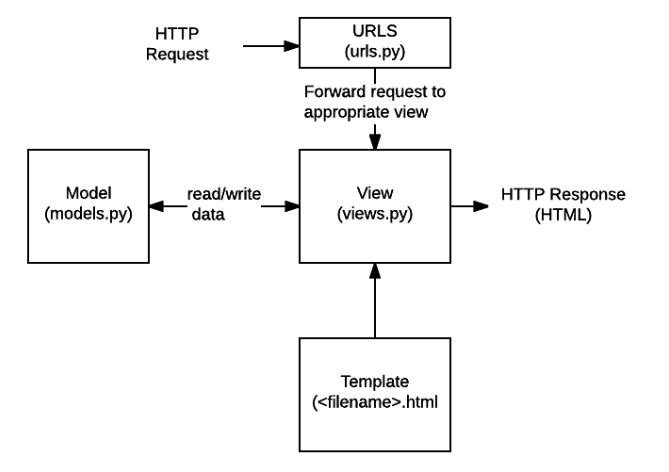
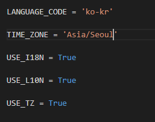
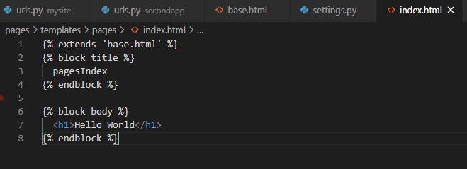
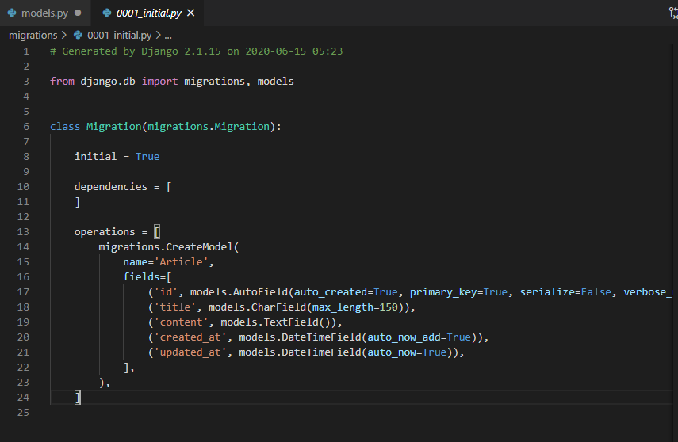
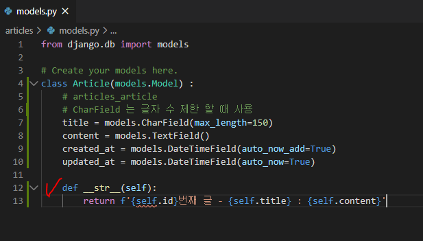
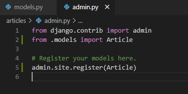
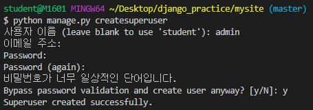
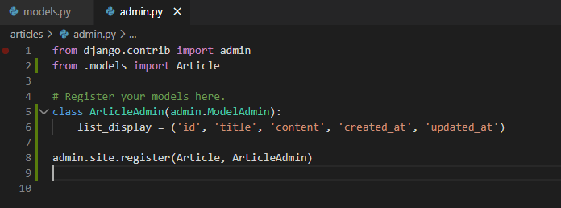

# django

> 파이썬으로 이루어진 WEB 프레임워크.

## django의 성격

- 파이썬을 이용하기 때문에 개발 속도가 빠르다.
- 프레임워크라는 것은? ----> 프랜차이즈의 성격을 갖는다 ( 내가 다 줄테니 너넨 사용만 해라~ )

## why django?

- 풍부한 언어와 프레임워크 사용 경험을 배양하기 위함.

## MTV

> 스프링의 MVC패턴과 같은 패턴임

Model - Template(사용자가 보는 화면) - View(중간 관리자)



- **URLs:** 단일 함수를 통해 모든 URL 요청을 처리하는 것이 가능하지만, 분리된 뷰 함수를 작성하는 것이 각각의 리소스를 유지보수하기 훨씬 쉽습니다. URL mapper는 요청 URL을 기준으로 HTTP 요청을 적절한 view로 보내주기 위해 사용됩니다. 또한 URL mapper는 URL에 나타나는 특정한 문자열이나 숫자의 패턴을 일치시켜 데이터로서 뷰 함수에 전달할 수 있습니다.
- **View:** view는 HTTP 요청을 수신하고 HTTP 응답을 반환하는 요청 처리 함수입니다. View는 Model을 통해 요청을 충족시키는 데 필요한 데이터에 접근합니다. 그리고 탬플릿에게 응답의 서식 설정을 맡깁니다.
- **Models:** Model은 application의 데이터 구조를 정의하고 데이터베이스의 기록을 관리(추가, 수정, 삭제)하고 query하는 방법을 제공하는 파이썬 객체입니다.. 
- **Templates:** 탬플릿은 파일의 구조나 레이아웃을 정의하고(예: HTML 페이지), 실제 내용을 보여주는 데 사용되는 플레이스홀더를 가진 텍스트 파일입니다. view는 HTML 탬플릿을 이용하여 동적으로 HTML 페이지를 만들고 model에서 가져온 데이터로 채웁니다. 탬플릿으로 모든 파일의 구조를 정의할 수 있습니다.탬플릿이 꼭 HTML 타입일 필요는 없습니다!

# Django Intro

## Strat Django

1. 장고 설치하기

```bash
pip install djang==2.1.15
pip list
```

2. 프로젝트 생성

```bash
django-admin startproject <프로젝트 명>
```

```bash
python manage.py runserver
```

3. 프로젝트 생성시 제공되는 파일
   - `manage.py`
     - 현재 django와 관련된 모든 명령어를 `manage.py`를 통해 실행합니다.
   - `__init__.py`
     - 현재 `__init__.py` 파일이 존재하는 폴더를 하나의 프로젝트 혹은 패키지로 인식시키게 해주는 파일
   - `settings.py`
     - 현재 프로젝트의 전체적인 설정 및 관리를 위해 존재하는 파일
   - `urls.py`
     - 내 프로젝트에 접근할 수 있는 경로를 설정하기 위한 파일
   - `wsgi.py`
     - ??배포용??


## Start App

### 1. Application 생성

``` bash
python manage.py startapp pages(프로젝트 명)
```

- setting.py에서 application 출생신고(?) 및 설정하기




- 다시 서버 시작해보기

```bash
cd intro/
python manage.py runserver
```


언어(한글) 및 시간(서울) 설정 완료!


### 2. urlPattern 및 `View`, `Template` 설정

- url. py : 경로설정


- views.py : 함수설정


- templates 안에 html파일 생성


`{{ }}` 안에 value 값을 넣어준다~

!!!

- 이렇게 key값과 value형태인 dictionary로 사용가능하다!


- **조금 더 깔끔하게 작성하기.**


- url에서 입력을 받을 때 특정 문자/숫자만 요청할 수 있다.


Q1

```python
# urls.py
path('urlcopy/<str:name>/<int:age>', views.urlcopy)

# views.py
def urlcopy(request, name, age):
    name = name
    age = age
    context={
        'name' : name,
        'age' : age
    }
    return render(request, 'urlcopy.html', context)


# urlcopy.html
<h2>URL로 입력받은 이름 : {{name}}, 나이 : {{age}}</h2>
```


Q2

```python
# urls.py
path('multiply/<int:num1>/<int:num2>', views.multiply)

# views.py
def multiply(request, num1, num2):
    num1 = num1
    num2 = num2
    result = num1 * num2
    context = {
        'num1' : num1,
        'num2' : num2,
        'result' : result
    }
    return render(request, 'multiply.html', context)

# multiply.html
URL로 받은 숫자1 : {{num1}} , 숫자2 : {{num2}}

곱한 값 => {{result}}
```


Q3

```python
# urls.py
path('multipletable/<int:big>/<int:small>', views.multipletable),

# views.py
def multipletable(request, big, small):
    result = []
    if(big < small):
        big, small = small, big
    for num in range(1, small+1):
        result.append(big*num)
    context={
        'result' : result
    }
    return render(request, 'multipletable.html', context)

# multiplly.html
<p>{{result}}</p>
<h1>Django Temlplate Lagnuage ( DTL )</h1>

<!--  -->
{# 이게 DTL의 주석 #}

DTL의 주석은 개발자모드(F12) 에서도 보이지 않는다!
여기는 전부
출력이 안됨... 주석임!
되도록이면 template에서는 주석사용 XX



  <p>{{num}}</p>

```


### 3. DTL 사용해보기

```python
# urls.py
path('dtl/', views.dtl),

# views.py
def dtl(request):
    mList = ['짜장면', '차돌짬뽕', '탕수육', '콩국수']
    empty_list = []
    mString = "Life is short, You need Python"
    today = datetime.now()
    context = {
        'mList' : mList,
        'empty_list' : empty_list,
        'mString' : mString,
        'today' : today
    }
    return render(request, 'dtl.html', context)

# dtl.html
<h1>1. for문</h1>

  <p> {{ forloop.counter }}.{{ food }} </p>



  <p>data</p>

  <p>비어있습니다.</p>

<hr>

<h1>2. 조건문</h1>

  
    <p>짜장면엔 고춧가루지 아암 이게맞지</p>
  
    <p>뭔 소리야 {{ food }}을 먹어줘야지</p>
  

<hr>


  
    <p> {{forloop.first}} </p>
    <p> {{forloop.last}} </p>
    <p>짜장면엔 고춧가루지 아암 이게맞지</p>
  
    <p>뭔 소리야 {{ food }}을 먹어줘야지</p>
  


<h1>3. filter 활용</h1>
  <p>{{ mString|lower }}</p>
  <p>{{ mString|upper }}</p>
  <p>{{ mString|title }}</p>
  <p>{{ mString|length }}</p>
  <p>{{ mString|truncatewords:3 }}</p>
  <p>{{ mString|truncatechars:10 }}</p>
<hr>

<h1>4. lorem ipsum</h1>
<p></p>
<p></p>
<p></p>
```


- advanced 조건문, 반복문

```python
# urls.py
path('forif/', views.forif),

# views.py
# 1. 간단한 반복문으로 리스트 각 요소를 출력
# 2. if, else 활용해서 문자열 비교
# 2-1. 내가 넘긴 문자열과 특정한 문자열 비교
# 3. if, elif, else 사용해보기
# 3-1. 문자열의 길이가 5 이하이면 short
# 3-2. 문자열의 길이가 10 이상이면 long
# 3-3. 모두 아니면 적당 출력

# 모두 작성했다면,
## 1) 반복문으로 리스트 각 요소를 출력해서
## 2) 해당 요소가 90 이상이면 A
## 3) 해당 요소가 70 이상이면 B
## 4) 그 외엔 C 출력
def forif(request):
    mList = [100, 50, 80, 71, 10]
    mString = '간단한 문자열zzzzzzzzzzzz'
    mInput = input("문자열을 입력하세요: ")
    data_a = '첫번째 데이터'
    data_b = '두번째 데이터'
    data_a, data_b = data_b, data_a
    context = {
        'mList' : mList,
        'mString' : mInput,
        'data_a' : data_a,
        'data_b' : data_b
    }
    return render(request, 'forif.html', context)

# forif.html
<h1>간단한 반복문으로 리스트 출력</h1>

  
  <P>{{ data }} : A</P>
  
  <P>{{ data }} : B</P>
  
  <p>{{ data }} : C</p>
  

<hr>

<h1>문자열의 길이</h1>

  <p>{{ mString|title }} : short</p>

  <p>{{ mString|title }} : long</p>

  <p>{{ mString|title }} : 적당</p>

```


## Django form태그 사용

- 프로젝트 기획 단계에서는 `페르소나` 를 중시해라!
- form 태그는 기본이 GET방식!

- **가져오는 방식이 2가지**
  - []  ---> 값이 없을 때 오류 발생

  - .get --->  값이 없어도 오류 발생 안함. 값이 없으면 none 출력
    - request.GET == 딕셔너리와 유사하다.
    - request.GET != dict()

```bas
print(request.GET['message'])
print(request.GET.get('message'))
```


### 절대경로? 상대경로?

- 절대경로 : 파일이 같이 올라가도 C:\에서 시작하는 그 경로로 접근할 수 없어서 이미지가 깨진다.

- 상대경로 : 루트경로로부터 작성된 경로로 찾아가기 때문에 해당 위치에 이미지가 있으면 찾을 수 있다.


Q1

```python
# 1. 사용자가 숫자 입력
# 2. 입력 받은 횟수 만큼 반복해서
# 3. 리스트에 로또 번호 담는다.
# 3-1. random.sample(range(1, 46), 6)
# 4. 사용자가 입력한 숫자와 로또번호가 담긴 리스트를 출력
# 5. ul태그를 사용하여 각 번호들을 한줄 씩 출력
# urls.py
path('lottoT/', views.lottoT),
path('lottoC/', views.lottoC),

# views.py
def lottoT(request):
    return render(request, 'lottoT.html')

def lottoC(request):
    num = int(request.GET.get('num'))
    lottos = []
    for data in range(num):
        lottos.append(random.sample(range(1, 46), 6))
    context={
        'num' : num,
        'lottos' : lottos,
    }

    return render(request, 'lottoC.html', context)

# lottoT.html
<h1> 로또 번호를 입력해주세용~ </h1>
<form action="/lottoC/">
  <label for="buy"> 구매 하고자 하는 갯수 : </label>
  <input type="number" name="num" id="buy">
  <input type="submit" value="제출" >
</form>

# lottoC.html
<h1> 결과는? </h1>
<p>로또를 {{num}}개 구매하셨습니다.</p>
<ul>
  
  <li>{{ lotto }}</li>
  
</ul>
```


## Second App

### 경로 분리하기

- 기존의 pages Application에 있던 urls의 view는 pages폴더 하위로 이사한다.

  ```python
  # urls.py ( project )
  from django.contrib import admin
  from django.urls import path, include
  
  urlpatterns = [
      path('secondapp/', include('secondapp.urls')),
      path('pages/', include('pages.urls')),
      path('admin/', admin.site.urls),
  ]
  
  # urls.py ( pages )
  from django.urls import path
  from . import views
  
  urlpatterns = [
      path('index/', views.index, name="index"),
      path('hello/', views.hello, name="hello"),
      path('name/', views.name, name="name"),
      path('introduce/', views.introduce, name="introduce"),
      path('classRandomChoice/', views.classRandomChoice, name="classRandomChoice"),
      path('yourname/<str:name>/', views.yourname, name="yourname"),
      path('urlcopy/<str:name>/<int:age>', views.urlcopy, name="urlcopy"),
      path('multiply/<int:num1>/<int:num2>', views.multiply, name="multiply"),
      path('multipletable/<int:big>/<int:small>', views.multipletable, name="multipletable"),
      path('dtl/', views.dtl, name="dtl"),
      path('forif/', views.forif, name="forif"),
      path('loop/', views.loop, name="loop"),
      path('throw/', views.throw, name="throw"),
      path('catch/', views.catch, name="catch"),
      path('lottoT/', views.lottoT, name="lottoT"),
      path('lottoC/', views.lottoC, name="lottoC"),
      path('artii/', views.artii, name="artii"),
      path('result/', views.result, name="result"),
  ]
  ```

- 추후에 페이지가 커지고 원활한 유지보수를 위해 path 경로에 name을 지정할 수 가 있다.

  - 경로가 바뀌더라도 form태그나 경로로 무언가를 요청하던 일이 있을 때 이름으로 지정하기.

  ex)

  ```python
  # urls.py
  path('catch/', views.catch, name="catch"),
  
  # html
  #### 원래는 "/pages/catch/" ####
  <form action="" method="GET">
    이름 : <input type="text" name="name">
    나이 : <input type="number" name="age">
    <input type="submit" value="제출">
  </form>
  ```

  

- 장고는 자동으로 templates 폴더를 가서 index를 가져온다.

  - settings와 urls에서 먼저 선언한것을 먼저 찾아옴
  - 따라서 모든 html을 templates 하위에 앱이름으로 폴더를 생성하고 옮겨준다.
  - views에 html을 return하는 부분에도 경로 수정하기.

  ex)

  ```python
  return render(request, 'pages/index.html', context)
  ```

### base bootstrap 설정

- 베이스 페이지를 만들기 위해 프로젝트에 templates 폴더를 만들고 html에 부트스트랩 적용

- base.html


- setting.py


=> **mysite에 있는 템플릿을 베이스로 사용하겠다!!**

- 다른 app에 있는 html에서 베이스로 지정되있는 템플릿을 extends 하여 사용할 수 있다.




### static 설정

- *폴더 구조가 바뀌면 서버를 껐다 켜주자!!*

- image와 같은 정적 파일을 사용하기 위해 template과 같은 위치에 static폴더 생성하기

  - setting.py

  

  - html

  

### 링크로 다른 앱 넘어가기

- urls.py에 app_name을 설정해주고 해당 app_name을 통해 페이지를 연결


# Django Project

## 프로젝트 생성

- Project Name : mysite
- App Name : articles

## 페이지 생성

1. **index page**
   - `/index/` : 현재 게시글 목록을 보여 줄 페이지
2. **create page**
   - `/new/` : 글 작성을 위한 form(제목&내용) 입력 페이지
   - `/create/` : 글 작성 결과(제목&내용)를 출력하는 페이지

## 추가

- base template 생성

---

## !!주의사항!!

- **urls.py 설정 분리**
  - app_name 설정 등
- **template 폴더 구조 분리 **


# Django ORM

> Object Relational Mapping 
>
> 스프링에서는 mybatis를 썼었고, 장고에서는 이를 위한 기능이 따로 존재한다!

드디어 models.py를 사용하기 시작합니다~

파이썬의 객체와 DB의 객체를 Mapping해주어야 한다.

그럼 파이썬의 객체는 어떻게 생성하는 가?

- Articles에 models 작성

```python
# models.py

# Create your models here.
class Article(models.Model) : 
    # articles_article
    # CharField 는 글자 수 제한 할 때 사용
    title = models.CharField(max_length=150)
    content = models.TextField()
    created_at = models.DateTimeField(auto_now_add=True)
    updated_at = models.DateTimeField(auto_now=True)
    
$ python manage.py makemigrations
$ python manage.py migrate articles
```

- python manage.py makemigrations : DB에 설계도 대로 반영을 해라!! 
  - migrations폴더에 아래의 설계도가 생성된다.



- python manage.py migrate articles : 해당 aritcles 설계도 대로만 스키마 테이블 만들어달라!
- **실제 DB에 반영되기 위해서는?!**

```python
$ python manage.py migrate
```


---

## CREATE

```python
# 직접 shell창 에서 작업하겠다.
$ python manage.py shell
>>> from articles.models import Article
>>> Article.objects.all()
```

**1. INSERT INTO 테이블명 (column1, column2...) VALUES (values1, values2...)**

```python
# 첫 번째 방법
>>> article = Article()
>>> article.title = 'first'
>>> article.content = 'django!!'
>>> article.save()
>>> article
### 실제로 DB가 들어갔는지 확인! (N) 이 생겼어요!
<Article: Article object (1)>
    
# 두 번째 방법
# 어느 변수에 어떤 값을 넣을건지 명시
# id가 생략되어 있을 뿐, 자동으로 생성된다.
>>> article = Article(title='second', content='django~!')
>>> article.save()
>>> article
<Article: Article object (2)>
    
# 세 번째 방법
# save() 과정 없이 바로 저장이 된다.
>>> Article.objects.create(title='third', content'django~~')
<Article: Article object (3)>
```

- 첫, 두번째 방법은 인스턴스를 생상하고 그 안에 넣었다면 세번째는 그냥 넣어준다.
  - 사용 용도가 다른것이다!!!!

---

## READ

**2. SELECT * FROM articles_article(테이블명)**

```python
# 전체 조회
>>> article = Article.objects.all()
>>> article
<QuerySet [<Article: Article object (1)>, <Article: Article object (2)>, <Article: Article object (3)>]>

## 보기가 좋지 않으니
>>> article[0].title
'first'

## 설정을 해줍시다~~
```



*스키마의 형태가 변경이 되면 migration을 해줘야 하지만 단지 데이터의 출력 형태가 변경되는 것은 쉘 창을 종료하고 다시 켜준다.*

```python
$ exit()
$ python manage.py shell
>>> from articles.models import Article
>>> Article.objects.all()
<QuerySet [<Article: 1번째 글 - first : django!!>, <Article: 2번째 글 - second : django~!>, <Article: 3번째 글 - third : django~~>]>
```


**3. SELECT * FROM articles_article WHERE title = 'first'**

```python
# 특정 제목 불러오기
>>> Article.objects.filter(title='first')
<QuerySet [<Article: 1번째 글 - first : django!!>]>

>>> Article.objects.create(title='first', content='hahahahahahahaha')
<Article: 4번째 글 - first : hahahahahahahaha>

>>> Article.objects.filter(title='first')        
<QuerySet [<Article: 1번째 글 - first : django!!>, <Article: 4번째 글 - first : hahahahahahahaha>]>
```


**SELECT * FROM articles_article WHERE title='first' LIMIT= 1**

```python
>>> Article.objects.filter(title='first').first()
>>> Article.objects.filter(title='first').last()

>>> Article.objects.filter(title='first')[0]
<Article: 1번째 글 - first : django!!>
```


**SELECT * FROM articles_article WHERE id=1**

> PK처럼 고유값을 가지고 있어서 단 하나만 가지고 올 수 있는 방법!

```python
>>> Articles.objects.get(id=1)
>>> Articles.objects.get(pk=1)
<Article: 1번째 글 - first : django!!>
        
# !!주의점!!
# 1.고유값이 아닌 내용을 필터링 해서 2개 이상의 값이 찾아지면 오류를 발생한다.
# 	-> .get()은 반드시 하나의 객체만 가져올 수 있다.
# 2. 없는 것을 가지고 오려고 해도 오류가 발생한다.
# 	-> filter는 빈 쿼리셋이 반환이 된다.
>>> Article.objects.filter(pk=10)
<QuerySet []>
```


**Like / startswith / endswith**

```python
# XXX__contains : XXX에 해당 ''을 포함하고 있는 객체 반환
>>> Article.objects.filter(title__contains='fir')
<QuerySet [<Article: 1번째 글 - first : django!!>, <Article: 4번째 글 - first : hahahahahahahaha>]>

>>> Article.objects.filter(title__startswith='se')
<QuerySet [<Article: 2번째 글 - second : django~!>]>

>>> Article.objects.filter(content__endswith='ha')
<QuerySet [<Article: 4번째 글 - first : hahahahahahahaha>]>
```

---

## UPDATE

**UPDATE articles_article SET title='byebye' WHERE id=1**

```python
# 수정
>>> article = Article.objects.get(pk=1)
>>> article.title = 'byebye'
>>> article
<Article: 1번째 글 - byebye : django!!>

## 보이는 shell에는 바뀐 것처럼 보이지만 실제 DB에 저장이 되려면 저장을 해줘야 한다.
>>> article.save()
```

---

## DELETE

**DELETE FROM articles_article WHERE id=1**

```python
# 삭제
>>> article = Article.objects.get(pk=1)
>>> article.delete()
(1, {'articles.Article': 1})

>>> article = Article.objects.get(pk=1)
## pk=1은 삭제하고 없기 때문에 오류가 난다.

## delete는 별도로 저장을 해주지 않아도 자동으로 DB에 반영이 된다.
```


## 관리자 페이지로 확인하기



```python
python manage.py runserver
```

- http://127.0.0.1:8000/admin


- 파이썬에는 슈퍼계정이 존재한다~

```python
# 모든 설정파일을 migrate 해준 뒤 슈퍼유저 생성
$ python manage.py migrate
$ python manage.py createsuperuser
```



- 이메일 생략하고 비밀번호 1q2w3e4r 설정 후 다시 http://127.0.0.1:8000/admin로 접속


- admin.py에서 커스터마이징하기!




customizing된 admin페이지를 확인할 수 있다 :)