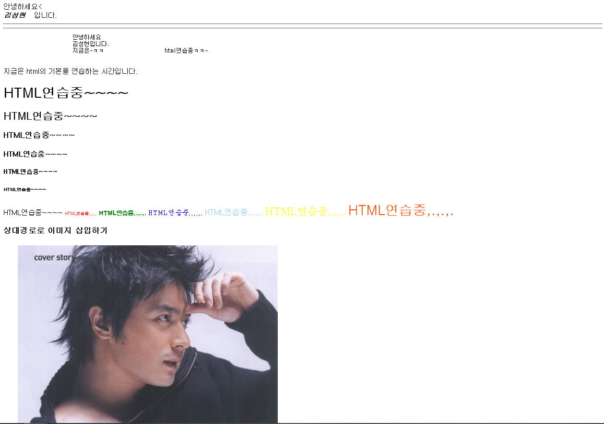
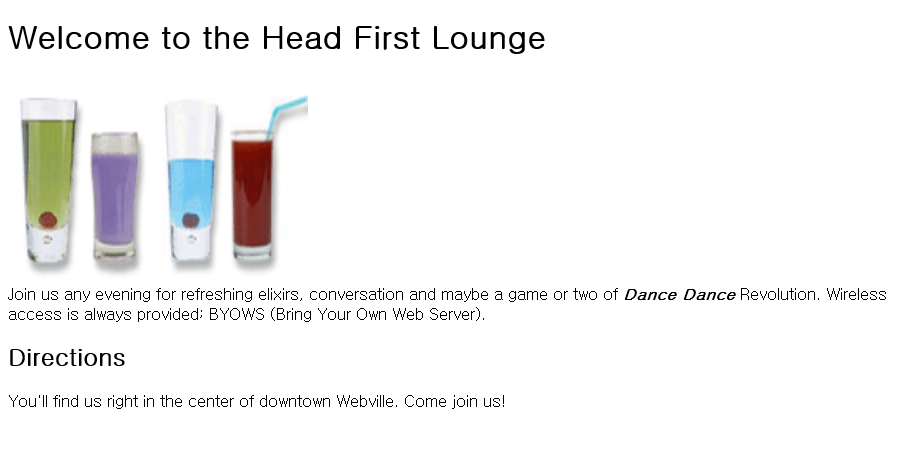
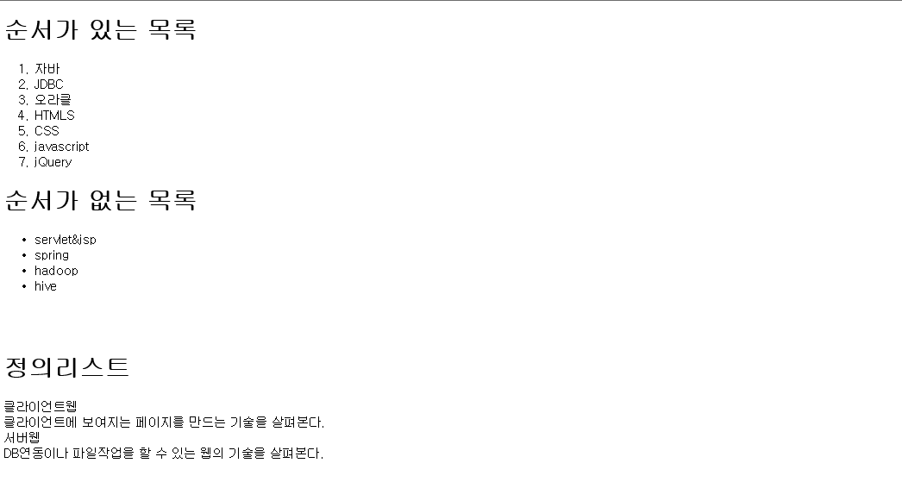
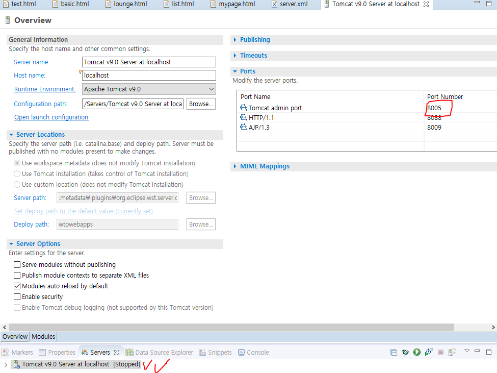

# WEB

## 19-12-30 월

* 우리가 말하는 웹서버는 : IIS , apache 등등(웹서버 역할을 하는 소프트웨어)
  
  * 이런 소프트웨어가 설치된 PC가 웹서버
* client에 보여주기 위한 기본 기술(프론트엔드) : html, css, javascript, jQuery

* WAS(Web Application Server)
  * Web logic, JEUS, **Tomcat(Test Server)**

    => 내부적으론 웹서버의 기능도 가지고 있으면서 자바를 실행할 수 있는 컨테이너의 기능을 갖고 있다.

* 결과를 조회해서 -> Servlet & JSP (서버기술 Application)

* Client Page + Web application/Server + DBMS(Oracle...SQL...) + Servlet&JSP

  => Spring같은 framwork 

  => 따라서 WEB은 전반적인 모든 것을 알고 있어야 한다

  

  ### 강의 순서

  1. 서버를 설치하고 작업.( Tomcat ) - apache.org
  2. 기본적으로 웹페이지를 어떻게 구성하는지.

* https 는 http에 보안이 적용되어있는 프로토콜.
* 웹페이지를 구성하는 요소?를 정의할 때  사용하는 기술 - **html (뼈대)**
* web 스타일 시트 - **css (꾸미기)**
* interactive - **javascript (대화형페이지)**  => 최근에 많이 중요해짐!!


## 19-12-31 화

* web은 제약사항이 없다~ 하려고하는 건 거의 다 구현할 수 있음.

* 내가 할만한거?

  * 음악 관련(가상악기)
  * 자동차 관련 - what? - 지도활용? - 부품? -기술?

* Client - WAS(webserver, container) - / / - Servlet&JSAP - JDBC - DBMS

  ​     << 프론트엔드 >>							<< 백엔드 >> ( 수업의 주 - servlet&jsp, spring framework )

* 어디서 장비추가? 어디서 빅데이터 활용? 어디서 보안 적용? 하는지 구조를 알아야 한다. 

* 웹요청 방식 : http://127.0.0.1:8088 / context명 / ( 폴더명 ) / 요청할 web application

    			프로토콜 :// 웹서버ip : port / 기본context는 생략(root) / 

  ​				   	( 웹의 기본port 80 생략가능 )

  * http://127.0.0.1:8088/docs/index.html : docs에 있는 index.html을 실행해라

* **Tomcat 9.0 - webapps - ROOT**

* 서버가 기본으로 인식하는 위치 : **Tomcat 9.0 - webapps**

* Web Application 폴더 ( Context )

* 서버에 대한 정의 : **Tomcat 9.0 - conf - server.xml**

  * 한글 인코딩 방식 : "UTF-8"  "EUC-"
  * <> : tag 혹은 엘리먼트 : 이런 것들을 markup 언어라고 한다

* 웹에 대한 정의 : **Tomcat 9.0 - conf - web.xml**

* 서버를 실행하면서 기록되는 파일들 : **Tomcat 9.0 - logs** => 싹다 기록된다 

  * 마케팅 전략으로 활용 가능

* 파일이 변환되는 위치가 저장되는 폴더 : Tomcat 9.0 - temp

* 서버가 스타트될 때 설정파일들을 모두 읽고 생성, 메모리 작업, 셋팅작업이 되기 때문에 무조건 xml을 변경할 때는 무조건 서버를 내렸다가 올려아 한다.

* 에러를 볼땐 밑에서부터!

### **중요

- http://127.0.0.1;8088/docs/index.html

  * 파일로 만들어져 있는 걸 찾아서 가져오는 것 - 정적 문서

- Context에는 어떤 폴더에 어떤 파일을 위치시키는 방법이 정형화 되어있다. - 동적문서

  * Context 

    *  jsp, html, js, image(jpg, gif, png) ,css, 

       * WEB-INF

            * web.xml : 설정파일
            * lib : 외부라이브러리
         * classes : 자바 파일(Servelt, DAO, DTO, 등)

         

* eclipse는 통합개발환경
  * eclipse에서 보여지는 위치는 그냥 우리가 보기 편하라고 보여지는 위치.
* setup -java- work - webwork - .metadata(설정 파일) - plugin
* **C:\iot\setup\java\work\webwork\.metadata\.plugins\org.eclipse.wst.server.core\tmp0\wtpwebapps\clientweb** : 서버가 인식하는 위치 => 작업시작 전 항상 띄워놓고 시작!

###  HTML

#### basic.html

```html
<!DOCTYPE html>
<html>
	<head>
		<meta charset="EUC-KR">
		<title>기본 html 연습</title>
	</head>
	<body>
		<!-- html주석(client에 전송되는 주석 : 주의) 김성현 -->
		안녕하세요&lt;<br/>
		<b><i>김성현</i></b>&nbsp;&nbsp;&nbsp;&nbsp;입니다.
		<hr/>
		<hr/>
		<pre>
			안녕하세요
			김성현입니다.
			지금은~ㅋㅋ 			html연습중ㅋㅋ~
		</pre>
		<p>지금은 html의 기본을 연습하는 시간입니다.</p>
		<h1>HTML연습중~~~~</h1>
		<h2>HTML연습중~~~~</h2>
		<h3>HTML연습중~~~~</h3>
		<h4>HTML연습중~~~~</h4>
		<h5>HTML연습중~~~~</h5>
		<h6>HTML연습중~~~~</h6>
		<h7>HTML연습중~~~~</h7>
		<font size="1" color="red" face="굴림">HTML연습중,.,.,.</font>
		<font size="2" color="green" face="HY견고딕">HTML연습중,.,.,.</font>
		<font size="3" color="blue" face="궁서">HTML연습중,.,.,.</font>
		<font size="4" color="skyblue" face="고딕">HTML연습중,.,.,.</font>
		<font size="5" color="yellow" face="바탕">HTML연습중,.,.,.</font>
		<font size="6" color="#ED4C00" face="굴림">HTML연습중,.,.,.</font>
		<h3>상대경로로 이미지 삽입하기</h3>
		
		
		
		<br/>
		<br/>
		<br/>
		<h3>절대경로로 이미지 삽입하기</h3>
		
		
	</body>
</html>
```



* ./은 현재경로 , ../은 상위경로
* http://127.0.0.1:8088 을 생략해도 된다. => 자동으로 root로 인식

#### lounge.html

```html
<!DOCTYPE html>
<html>
<head>
<meta charset="EUC-KR">
<title>Insert title here</title>
</head>
<body>
<h1>Welcome to the Head First Lounge</h1>

<p>Join us any evening for refreshing elixirs, conversation and maybe a game or two of
<b><i>Dance Dance</i></b> Revolution. Wireless access is always provided; 
BYOWS (Bring Your Own Web Server).</p>
<h2>Directions</h2>
<p>You'll find us right in the center of downtown Webville.  Come join us!</p>
</body>
</html>
```



#### list.html

```html
<!DOCTYPE html>
<html>
<head>
<meta charset="EUC-KR">
<title>Insert title here</title>
</head>
<body>
	<h1>순서가 있는 목록</h1>
	<ol>
		<li>자바</li>
		<li>JDBC</li>
		<li>오라클</li>
		<li>HTMLS</li>
		<li>CSS</li>
		<li>javascript</li>
		<li>jQuery</li>
	</ol>
	<h1>순서가 없는 목록</h1>
	<ul>
		<li>servlet&jsp</li>
		<li>spring</li>
		<li>hadoop</li>
		<li>hive</li>
	</ul>
	<br/><br/>
	<h1>정의리스트</h1>
	<dl>
		<dt>클라이언트웹</dt>
		<dt>클라이언트에 보여지는 페이지를 만드는 기술을 살펴본다.</dt>
		<dt>서버웹</dt>
		<dt>DB연동이나 파일작업을 할 수 있는 웹의 기술을 살펴본다.</dt>
	</dl>
</body>
</html>
```



#### mypage.html

```html
<!DOCTYPE html>
<html>
	<head>
		<meta charset="EUC-KR">
		<title>김성현을 알아봅시다</title>
	</head>
	<body>
	<h1>WHO</h1>
	<ul>
		<li><font size="4" face="HY견고딕">hair : black</font></li>
		<li><font size="4" color="skyblue" face="HY견고딕">name : 김성현</font></li>
		<li><font size="4" color="blue" face="HY견고딕">height : 170</font></li>
		<li><font size="4" face="HY견고딕">UNIV : KOOKMIN</font></li>
		<li><font size="5" color="red" face="궁서">age : 27.999</font></li>
		<li><font size="4" color="blue" face="HY견고딕">hometown : Ulsan</font></li>
		<li><font size="4" color="skyblue" face="HY견고딕">weight : 62</font></li>
		<li><font size="5" color="red" face="바탕">탑레이팅 : PLATINUM 1 100</font></li>
		<li><font size="4" face="고딕">3대 : 60</font></li>
		<li><font size="4" color="#53C14B" face="HY견고딕">hobby1 : 참이슬</font></li>
		<li><font size="4" face="HY견고딕">hobby2 : 넷플릭스</font></li>
		<li><font size="3" face="HY견고딕">hobby3 : 작사작곡랩</font></li>
	</ul>
	<h1>조카의 AGE</h1>
	<font size = "5"> 8.999 </font>
	<h1>조카의 특징</h1>
	<p><font size = "5"> 귀엽습니다 </font>
	<br/>
	<font size = "5"> 사진은 없습니다ㅜ </font></p>
	<h1>제 장래희망</h1>
	
	<h1>HOW?</h1>
	
	<br/>
	<pre>                                    <font size="5" face="궁서"><b>열심히!!</b></font></pre>
	
	</body>
</html>
```

## 20-01-02 목




* 집에서 할 때 반드시 등록해줘야함(서버 더블클릭)

* C:\iot\setup\java\work\webwork\clientweb 여기 있는 것들이 표준화된 폴더 구조인C:\iot\setup\java\work\webwork\.metadata\.plugins\org.eclipse.wst.server.core\tmp0\wtpwebapps\clientweb(서버가 인식하는 위치)로 복사되어 들어가는 것이다.


### HTML

#### table.html

```html
<!DOCTYPE html>
<html>
<head>
<meta charset="EUC-KR">
<title>Insert title here</title>
</head>
<body>
	<h1>테이블연습</h1>
	<table border="1" width="561">
		<tr bgcolor="green">
			<th>번호</th>
			<th>제목</th>
			<th>저자</th>
		</tr>
		<tr align="center">
			<td>1</td>
			<td>이클립스</td>
			<td rowspan="2">스테파니메이어</td>
		</tr>
		<tr>
			<td>2</td>
			<td>트와일라잇</td>
		</tr>
		<tr>
			<td>3</td>
			<td>감자</td>
			<td>강원도</td>
		</tr>
		<tr>
			<td colspan = "3">비고:<br/>
			지금은 table을 작성하기 위해 필요한 태그의 연습 중입니다.</td>
		</tr>
	
	</table>
</body>
</html>
```

```html
<!DOCTYPE html>
<html>
<head>
<meta charset="EUC-KR">
<title>Insert title here</title>
</head>
<body>
<table border="1" width="500" height="500" style="text-align: center;" mathlength="20">
	<tr>
		<td>1</td>
		<td colspan="2">2</td>
		<td colspan="2" rowspan="2">3</td>
	</tr>
	<tr>
		<td>4</td>
		<td rowspan="2">5</td>
		<td>6</td>
	</tr>
	<tr>
		<td>7</td>
		<td colspan="3">8</td>
	</tr>
	<tr>
		<td colspan="3">9</td>
		<td colspan="2">10</td>
	</tr>
</table>
</body>
</html>
```


#### formTest.html

* 양식태그 : action과 mehod는 서버로 데이터를 보낼 때 굉장히 중요한 속성이다! 

  ```html
  <!DOCTYPE html>
  <html>
  <head>
  <meta charset="EUC-KR">
  <title>Insert title here</title>
  </head>
  <body>
  	<h1>양식태그 테스트하기</h1>
  	<form action="/clientweb/member/login.jsp" method="get">
  		<h2>fieldset이용하기</h2>
  		<fieldset>
  		<h3>좋아하는 과목</h3>
  			<input type="checkbox" name="subject1" value="자바">자바
  			<input type="checkbox" name="subject1" value="JDBC">JDBC
  			<input type="checkbox" name="subject1" value="HTML5">HTML5
  			<input type="checkbox" name="subject1" value="Servlet" checked="checked">Servlet
  			<br/><br/>	
  		</fieldset>
  	
  		<h2>1. 텍스트 관련 태그</h2>
  		아이디 : <input type="text" name="id" size="100" maxlength="20"/><br/>
  		패스워드 : <input type="password" name="pass"><br/>
  		닉네임 : <input type="text" name="nickname" value="별칭을  입력하세요" disabled="disabled"><br/>
  		비고:<br/>
  		<textarea rows="30" cols="30" name="info">자기소개:</textarea>
  		
  		<h2>2. 버튼 관련 태그</h2>
  		<input type="submit" value="서버로 전송하기">
  		<input type="reset" value="입력 취소하기">
  		<input type="button" value="자바스크립트 연결하는 버튼"
  				onclick="alert('환영합니다.')"/>
  				
  				
  		<h2>3. 선택관련태그</h2>
  		<h3>좋아하는 과목</h3>
  		<input type="checkbox" name="subject1" value="자바">자바
  		<input type="checkbox" name="subject1" value="JDBC">JDBC
  		<input type="checkbox" name="subject1" value="HTML5">HTML5
  		<input type="checkbox" name="subject1" value="Servlet" checked="checked">Servlet
  		<br/><br/>		
  		
  		<h3>좋아하는 과목</h3>
  		<input type="radio" name="subject2" value="자바">자바
  		<input type="radio" name="subject2" value="JDBC" checked="checked">JDBC
  		<input type="radio" name="subject2" value="HTML5">HTML5
  		<input type="radio" name="subject2" value="Servlet">Servlet
  		<br/><br/>
  		
  		<h3>좋아하는 과목</h3>
  		<select name="subject3">
  			<option value="hadoop">hadoop</option>
  			<option value="hive">hive</option>
  			<option value="mongodb">mongodb</option>
  			<option value="sqoop">sqoop</option>
  		</select>
  		<br/><br/>
  		
  		<h3>좋아하는 과목</h3>
  		<select name="subject4" size="10" multiple="multiple">
  			<option value="hadoop">hadoop</option>
  			<option value="hive">hive</option>
  			<option value="mongodb">mongodb</option>
  			<option value="sqoop">sqoop</option>
  		</select>
  		<br/><br/>
  		
  		<h2>4. 기타 태그</h2>
  		<input type="file" name="photo" value="파일선택">
  		<input type="date" name="regdate">
  		<input type="number" name="count">
  		<input type="email" name="mymail">
  	</form>
  </body>
  </html>
  ```

  => 양식관련 태그는 반드시 <form> 을 이용해라!!

  * get은 요청메시지 헤더에 우리가 입력한 데이터들이 넘어가는 것. => 그대로 노출 된다
  * post는 요청메시지 바디에 숨겨져서 내보냄 => 노출되지 않음
  * action에 들어가는 건 절대경로로 주는 것이 일반적
  * submit의 역할 : 액션에 명시되어있는 애플리케이션을 새롭게 요청하면서 실행과 동시에 form과 /form 사이에 있는 모든 로그인정보를 호출한다. => 데이터를 서버로 전송하고 싶으면 form과 /form 사이에 입력해라
  * reset의 역할 : 다시 지우는 버튼
  * onclick : 내가 이버튼을 클릭했을 때

#### customer.html

```html
<!DOCTYPE html>
<html>
<head>
<meta charset="EUC-KR">
<title>Insert title here</title>
</head>
<body>
	<table border="1" width="400" height="400" style="text-align: left;">
		<tr>
			<td colspan="2" align="center"><b>회원가입</b></td>
		</tr>
		<tr>
			<td>이름</td>
			<td><input type="text" name="name" maxlength="10"/></td>
		</tr>
		<tr>
			<td>사용자 ID</td>
			<td><input type="text" name="id" maxlength="20"/></td>
		</tr>
		<tr>
			<td>암호</td>
			<td><input type="password" name="pass" maxlength="20"></td>
		</tr>
		<tr>
			<td>암호확인</td>
			<td><input type="password" name="passcheck" maxlength="60"></td>
		</tr>
		<tr>
			<td>주민등록번호</td>
			<td><input type="text" name="regnum1" size="13" maxlength="6"/>-
			<input type="text" name="regnum2" size="13" maxlength="7"/></td>
		</tr>
		<tr>
			<td>전화번호</td>
			<td><input type="number" name="phone1" maxlength="3" size="8"/>-
			<input type="number" name="phone2" maxlength="4" size="8"/>-
			<input type="number" name="phone3" maxlength="4" size="8"/></td>
		</tr>
		<tr>
			<td>성별</td>
			<td><input type="radio" name="sex" value="남자">남자
		<input type="radio" name="sex" value="여자">여자</td>
		</tr>
		<tr>
			<td>직업</td>
			<td>
			<select name="job" size="1">
			<option value="웹디자이너">웹디자이너</option>
			<option value="개발자">개발자</option>
			<option value="빅데이터개발자">빅데이터개발자</option>
			<option value="DBA">DBA</option>
			<option value="임베디드개발자">임베디드개발자</option>
			</select>
			</td>
		</tr>
		<tr>
			<td>email주소</td>
			<td><input type="email" name="mymail"></td>
		</tr>
		<tr>
			<td colspan="2" align="center"><input type="submit" value="가입신청">
		<input type="reset" value="취소"></td>
		</tr>
	</table>
</body>
</html>
```


* http://www.html5test.com
* www.data.go.kr

### CSS

* html에서는 못하는 화면 구성이나 레이아웃을 배치할 수 있음.
  * 그룹으로 묶을 수 있어야함
    * div : 줄바꿈이 필요할 떄
    * span : 줄바꿈이 필요없을 때

#### block_tag.html

```html
<!DOCTYPE html>
<html>
<head>
<meta charset="EUC-KR">
<title>Insert title here</title>
</head>
<body>
	<div>
		div와 span태그는 논리적인 그룹을 분리할 때 사용하는 태그이다.
		div와 span태그는 논리적인 그룹을 분리할 때 사용하는 태그이다.
		div와 span태그는 논리적인 그룹을 분리할 때 사용하는 태그이다.
	</div>
		div와 <span>span태그는</span> 논리적인 그룹을 분리할 때 사용하는 태그이다.
		<p>
		div와 span태그는 논리적인 그룹을 분리할 때 사용하는 태그이다.
		div와 span태그는 논리적인 그룹을 분리할 때 사용하는 태그이다.
		div와 span태그는 논리적인 그룹을 분리할 때 사용하는 태그이다.
		</p>
		div와 <span>span태그는</span> 논리적인 그룹을 분리할 때 사용하는 태그이다.
</body>
</html>
```


